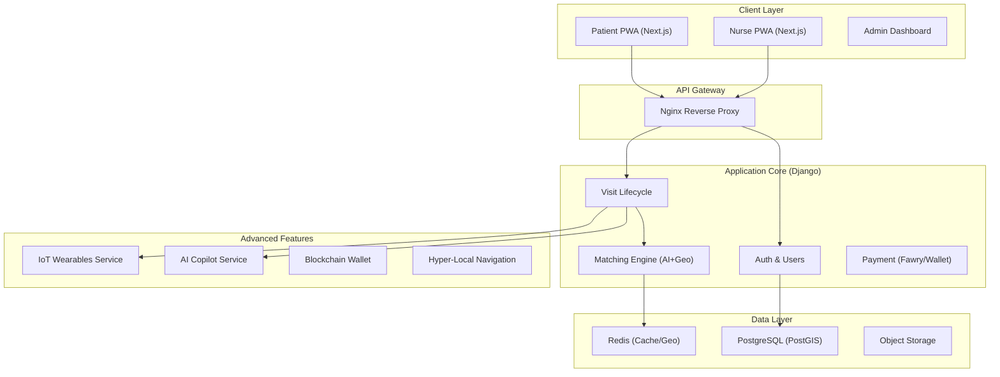

  
  <h1>Wateen (وَتِين)</h1> 
  <h2>Primary Domain: wateen.live</h2>
=======

  
<strong>AI-Powered Healthcare Ecosystem for Egypt</strong>

  

    <b>English</b> | <a href="#-ملخص-تنفيذي">العربية</a>
  

---

## 📌 Executive Summary

**The Problem:** Egypt's healthcare market faces fragmentation, with 60% of areas lacking reliable addressing and a significant shortage of accessible nursing care (2.5 doctors/1000 citizens).

**The Solution:** **Wateen** is an AI-Native Healthcare Ecosystem designed specifically for the Egyptian market. It evolves beyond a standard "Uber for Nurses" model into a comprehensive platform integrating **IoT Wearables**, **AI Clinical Copilots**, **Blockchain Health Wallets**, and **Hyper-Local Navigation** to bridge the gap between patients and quality care.

### 📄 ملخص تنفيذي

**المشكلة:** يعاني سوق الرعاية الصحية في مصر من التشتت، حيث تفتقر 60% من المناطق للعنونه الدقيقة، بالإضافة إلى نقص كبير في خدمات التمريض الموثوقة.

**الحل:** **وتيد (Wateen)** هو نظام بيئي صحي مدعوم بالذكاء الاصطناعي مصمم خصيصاً للسوق المصري. يتجاوز النموذج التقليدي لطلب التمريض ليقدم منصة متكاملة تشمل **أجهزة إنترنت الأشياء (IoT)**، **مساعد طبي ذكي (AI Copilot)**، **سجلات صحية مؤمنة بالبلوك تشين**، و**نظام ملاحة محلي فائق الدقة** لربط المرضى برعاية صحية عالية الجودة.

---

## 🏗️ System Architecture

Wateen utilizes a **Modular Monolith** architecture optimized for the "Hyper-Pair Programming" model (Solo Dev + AI). This guarantees strict domain boundaries, high-velocity development, and future readiness for microservices migration.

---

## 🚀 Tech Stack

| Category       | Technology                         | Purpose                                              |
| :------------- | :--------------------------------- | :--------------------------------------------------- |
| **Backend**    | **Python 3.11 + Django 5**         | Core business logic, robust ORM, and secure APIs.    |
| **Frontend**   | **Next.js 14 + Tailwind CSS**      | Server-Side Rendering (SSR) and PWA (Offline-first). |
| **Database**   | **PostgreSQL 16 + PostGIS**        | Relational data and complex geospatial queries.      |
| **Real-time**  | **Django Channels + Redis**        | WebSockets for live tracking and notifications.      |
| **AI / ML**    | **Pandas + Scikit-learn + OpenAI** | Predictive analytics, NLP, and decision support.     |
| **DevOps**     | **Docker + Docker Compose**        | Containerized development and production parity.     |
| **Blockchain** | **Hyperledger Fabric**             | Immutable audit trails for health records.           |

---

## ✨ Key Features (The "Uber" Logic)

- **🤖 AI Copilot:** A medical decision support system enabling nurses to query protocols, drug interactions, and dosage calculations in Arabic.
- **📍 Hyper-Local Navigation:** Custom mapping engine designed to handle Egypt's unstructured addresses using landmarks and crowd-sourced pins.
- **⌚ IoT Integration:** Real-time ingestion of patient vitals (Heart Rate, SpO2) from wearables directly into the nurse dashboard.
- **🛡️ Shield Protocol:** Audio safety system that uses AI to detect distress signals (screams, aggression) during visits.
- **🔗 Blockchain Health Wallet:** Patient-controlled, immutable health records secured by Smart Contracts.

---

## 🤝 Contribution & Team

**Execution Model: Hyper-Pair Programming**

This project is executed by a unique "Solo Dev + AI" unit:

- **Human Lead:** Product Architecture & Logic Validation.
- **AI Engine (Wateen Gem I):** Code Generation, Testing, and Documentation.

_Built with ❤️ for Egypt._
