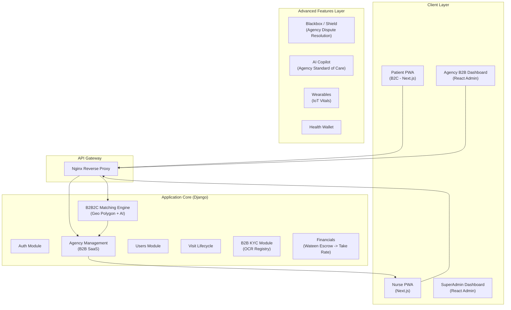
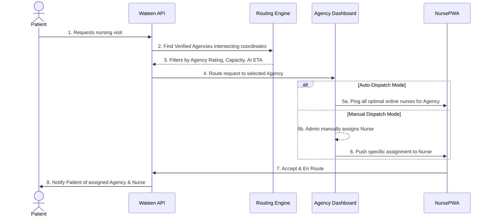
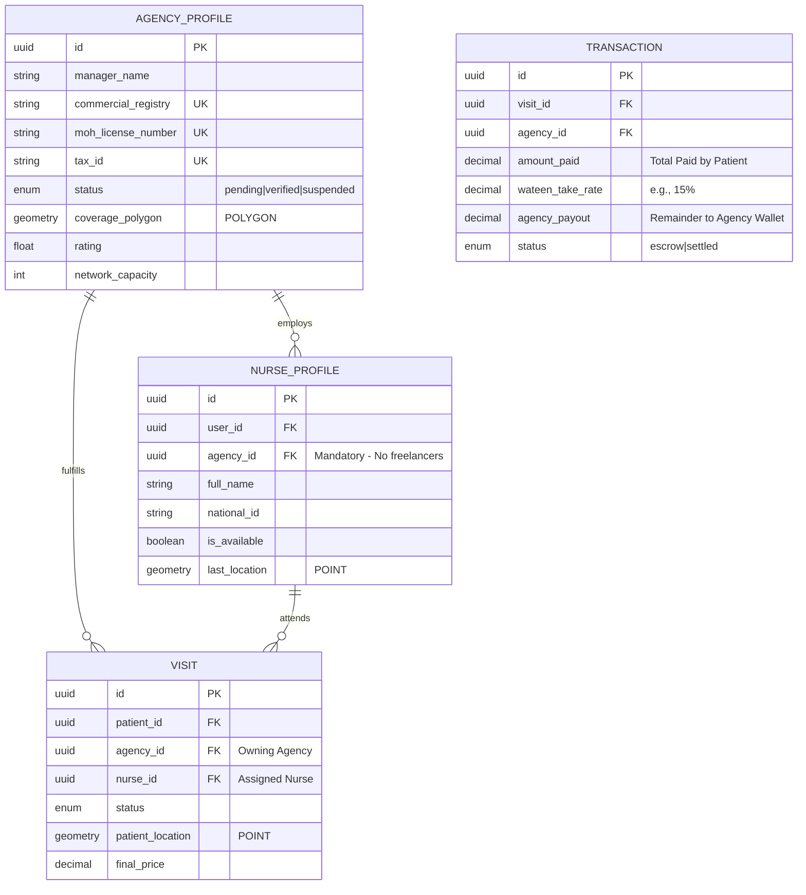

# 🏥 Wateen (وَتِين) — Master Implementation Plan v4.0 (B2B2C Edition)

> **Primary Domain:** wateen.live
> **Version:** 4.0 — February 2026
> **Edition:** AI-Native Solo Operator  
> **Target Market:** Egypt (Arabic-first, RTL)  
> **Architecture:** B2B2C Aggregator Model (SaaS + Marketplace)
> **Execution Model:** Hyper-Pair Programming — Solo Dev + AI

---

## 1. Executive Summary

Wateen represents a transformative leap in healthcare delivery for Egypt. To strictly comply with Egyptian Ministry of Health laws, Wateen executes a **B2B2C Aggregator Model**. Wateen serves as the technology provider and marketplace operator, onboarding Licensed Nursing Agencies (B2B). These agencies legally employ and manage their own nurses. Patients (B2C) request services via the Wateen platform, and Wateen intelligently routes requests to the optimal Agency, ensuring fully compliant and high-quality care.

### 1.1 Vision & Strategic Objectives

**Primary Vision:** Establish Wateen as Egypt's leading B2B2C digital healthcare aggregator, empowering Licensed Nursing Agencies with SaaS tools while giving patients seamless on-demand access to verified professionals.

**Strategic Objectives:**

- Provide a robust B2B SaaS Dashboard for Agencies to manage nurses, dispatching, and financials.
- Ensure 100% compliance with MoH by authenticating Agency Commercial Registries and Licenses.
- Auto-route and optimally dispatch patient visits based on Agency `coverage_polygon`, Rating, and Capacity.
- Retain the **Hyper-Pair Programming** (Solo Dev + AI) execution model without scaling headcounts.

---

## 2. الهيكلية التقنية (Architecture)

### 2.1 B2B2C Architecture Decision

We adopt a Modular Monolith optimized for the B2B2C workflow. Wateen supplies a B2B SaaS Dashboard to Agencies, a PWA to Patients, and a PWA to Agency-employed Nurses.

### 2.2 Data Flow: B2B2C Enhanced Visit Lifecycle

---

## 3. المنطق الأساسي (The 'Uber' Logic for B2B2C)

### 3.1 Two-Tier Matching Engine

When a patient requests a visit, Wateen does **not** ping freelance nurses. Operations are Agency-centric.

1. **Agency Filtering (PostGIS):** System searches for `AGENCY_PROFILE` where `status='verified'` and `coverage_polygon` intersects the patient's coordinates.
2. **Agency Ranking:** Ranked by Agency Rating, available capacity (online nurses), and AI-predicted average response time.
3. **Dispatching Mode (configured per Agency):**
   - **Auto-Dispatch Mode:** Pings all online, available nurses belonging _only_ to the matched Agency. First nurse to accept claims the visit for the Agency.
   - **Manual Dispatch Mode:** Request appears on the B2B SaaS Dashboard. The Agency Admin assesses their nurses and manually assigns the visit.
4. **Escalation:** If the Agency rejects or times out, Wateen routes the request to the next highest-ranked Agency.

---

## 4. Database Schema Strategy (B2B2C Extensions)

### 4.1 Required ERD Changes

### 4.2 Financial Flow (Escrow & Take Rate)

Patient pays Wateen securely. Funds land in **Wateen’s Escrow**. Upon visit completion, Wateen automatically deducts the platform "Take Rate" (e.g., 15%) and deposits the remainder into the **Agency Wallet**. Wateen does not pay nurses directly; agencies manage nurse payroll.

---

## 5. 20-Phase Implementation Roadmap (Adapted for B2B2C)

### Foundation & B2B Pivot (Phases 1-4)

- **Phase 1 (Weeks 1-4):** Project Setup, Docker, Auth System. Add Agency Admin user roles.
- **Phase 2 (Weeks 5-8):** **Agency Onboarding Portal**. Build B2B KYC Engine (OCR focused on Commercial Registry & MoH Licenses).
- **Phase 3 (Weeks 9-12):** **B2B SaaS Dashboard (React Admin)**. Agencies can login, draw their `coverage_polygon` on a map, and invite nurses.
- **Phase 4 (Weeks 13-16):** Patient Request Flow & Two-Tier Routing Engine (Auto vs Manual Dispatch). Payment escrow setup.

### Deep-Tech & Agency Empowerment (Phases 5-10)

- **Phase 5 (Weeks 17-18):** Patient PWA & Nurse PWA refinement with Agency branding components.
- **Phase 6 (Weeks 19-20):** **Blackbox & Shield (Basic)**. Audio recordings protect Agency/Nurse. Agency Admins get access to dispute resolution logs.
- **Phase 7 (Weeks 21-22):** **AI Copilot (Basic)**. Standardizes medical care across all onboarded Agencies via AI-assisted protocols.
- **Phase 8 (Weeks 23-24):** Hyper-Local Navigation for Nurses.
- **Phase 9 (Weeks 25-26):** **IoT Wearables**. Patients connect devices; Agencies monitor real-time assigned patient vitals.
- **Phase 10 (Weeks 27-28):** Basic Telemedicine (Agency Doctors / Patient Consults).

### Advanced Scalability (Phases 11-20)

- **Phase 11 (Weeks 29-30):** Health Wallet (Blockchain Records) MVP.
- **Phase 12 (Weeks 31-32):** AI Epidemic Prediction.
- **Phase 13 (Weeks 33-34):** Automated Agency Settlement & Financial Invoicing.
- **Phase 14 (Weeks 35-36):** Advanced AI Copilot (RAG for custom MoH guidelines).
- **Phase 15 (Weeks 37-38):** Gamification & Quality Scoring for Agencies.
- **Phases 16-20:** E2E Load Testing, Deployment Pipelines, Penetration Testing, MoH Compliance Audits, Launch.

---

## 6. Advanced Features Adaptation (Agency Context)

1. **Blackbox / Shield System:** Physical and legal protection infrastructure. The encrypted session logs are directly accessible by the **Agency Admin** and Wateen SuperAdmin to solve patient-nurse disputes locally, transferring liability properly.
2. **AI Copilot:** Given different agencies might have different internal calibers of nurses, the Wateen AI Copilot acts as an operational equalizer, enforcing a rigid standard of care and providing real-time dosage/decision support to the agency’s staff.

---

## 7. Execution Rules (Hyper-Pair Programming)

- **Tech Stack remains strictly:** Next.js, Django 5, PostgreSQL, PostGIS, Redis.
- **Wateen supplies B2B dashboards** using rapid tools like React Admin to save development time.
- **Solo Dev + AI Context:** Code architecture is fully modular, adhering completely to MoH laws while minimizing administrative overhead for the Solo Dev.

> **Document prepared for:** Wateen — Hyper-Pair Programming Team
> **Execution Model:** Solo Dev + AI (Wateen Gem I)
> **Edition:** v4.0 (B2B2C Pivot)
