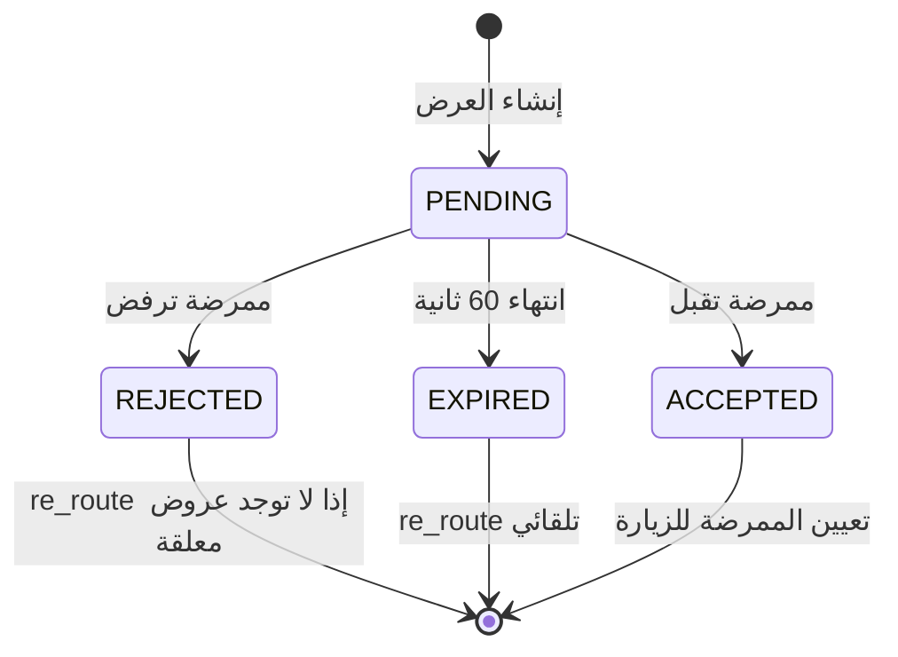
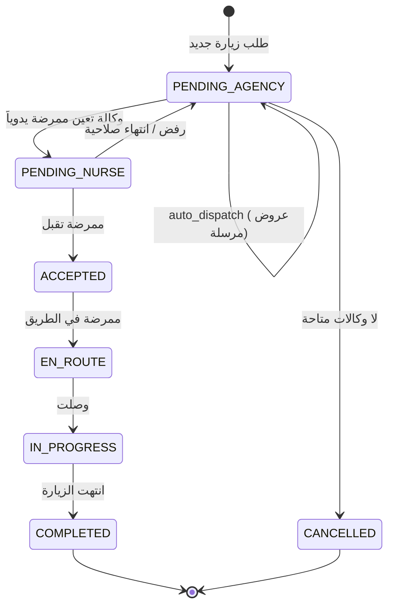

# 📋 تقرير هندسة التذكرة [P4-T4] — نظام التوزيع التلقائي (Auto-Dispatch System)

> **المنصة:** وتين (Wateen) — مُجَمِّع رعاية صحية منزلية B2B2C  
> **التذكرة:** `P4-T4` | **المرحلة:** Phase 4  
> **التاريخ:** 2026-03-11  
> **المهندس:** Senior Staff Software Engineer  
> **الحالة:** ✅ مكتملة بالكامل (8 مراحل)

---

## 1. الملخص التنفيذي

تم تنفيذ نظام التوزيع التلقائي (Auto-Dispatch) لمنصة وتين بنجاح كامل. النظام يقوم بتوزيع طلبات الزيارات المنزلية تلقائياً على أقرب 5 ممرضات متاحات تابعات للوكالة المعينة، باستخدام محرك PostGIS المكاني. يتضمن النظام حماية متقدمة ضد التزامن (Concurrency Control)، آلية إعادة توجيه ذكية (Intelligent Re-routing)، وإشعارات فورية عبر WebSocket و FCM.

---

## 2. السياق المعماري الحرج (B2B2C Enforcement)

```
┌─────────────┐     ┌─────────────────┐     ┌───────────────┐
│   مريض      │────▶│  منصة وتين     │────▶│   وكالة       │
│  (Patient)  │     │  (Aggregator)   │     │  (Agency)     │
└─────────────┘     └─────────────────┘     └───────┬───────┘
                                                    │
                                            ┌───────▼───────┐
                                            │  ممرضات       │
                                            │  (Nurses)     │
                                            └───────────────┘
```

**القاعدة الذهبية:** كل ممرضة تنتمي إجباريا لوكالة. التوزيع التلقائي يتم **فقط** على ممرضات الوكالة المعينة للزيارة. يُمنع منعاً باتاً التعامل مع الممرضات كمستقلات.

---

## 3. الخوارزميات المستخدمة

### 3.1 خوارزمية البحث المكاني (Spatial Nearest-Neighbor Search)

**الملف:** `visits/services/dispatch_service.py`  
**الدالة:** `auto_dispatch_to_nurses(visit_id, agency_id)`

#### الوصف التفصيلي
تستخدم الخوارزمية محرك PostGIS لحساب المسافة الجغرافية بين موقع الزيارة ومواقع الممرضات المتاحات، ثم ترتيبهن تصاعدياً حسب القرب.

#### الاستعلام المكاني (SQL Query المولّد)
```python
nearest_nurses = NurseProfile.objects.filter(
    agency_id=agency_id,           # B2B2C: فقط ممرضات الوكالة المحددة
    is_available=True,             # متاحة حالياً
    verification_status=VerificationStatus.VERIFIED,  # موثقة من وزارة الصحة
    last_location__isnull=False    # لديها موقع GPS مسجل
).annotate(
    distance=Distance('last_location', visit.location)  # PostGIS ST_Distance
).order_by('distance')[:5]  # أقرب 5 ممرضات فقط
```

#### الاستعلام المكافئ في SQL الخام
```sql
SELECT np.*, ST_Distance(np.last_location, visit.location) AS distance
FROM users_nurseprofile np
WHERE np.agency_id = :agency_id
  AND np.is_available = TRUE
  AND np.verification_status = 'VERIFIED'
  AND np.last_location IS NOT NULL
ORDER BY distance ASC
LIMIT 5;
```

#### تعقيد الخوارزمية (Big-O Complexity)
| العملية | التعقيد | الشرح |
|---------|---------|-------|
| فلترة الممرضات | `O(N)` | مسح جدول الممرضات بالفلاتر |
| حساب المسافة PostGIS | `O(N)` | `ST_Distance` لكل صف |
| الترتيب حسب المسافة | `O(N log N)` | فرز نتائج المسافة |
| التقطيع `[:5]` | `O(1)` | `LIMIT 5` على مستوى SQL |
| **الإجمالي** | **`O(N log N)`** | حيث N = عدد ممرضات الوكالة |

#### تحسين الأداء المطبّق
```python
# ❌ قبل التحسين: ضربتان لقاعدة البيانات
nearest_nurses = NurseProfile.objects.filter(...)[:5]
if not nearest_nurses.exists():  # ← DB Hit #1
    return False
for nurse in nearest_nurses:     # ← DB Hit #2
    ...

# ✅ بعد التحسين: ضربة واحدة فقط
nearest_nurses_list = list(nearest_nurses)  # ← DB Hit #1 (الوحيد)
if not nearest_nurses_list:
    return False
for nurse in nearest_nurses_list:
    ...
```

---

### 3.2 خوارزمية التحكم بالتزامن (Concurrency Control — Pessimistic Locking)

**الملف:** `visits/views.py` — `NurseRespondOfferView`

#### المشكلة
عند إرسال عرض لـ 5 ممرضات في آن واحد، قد تحاول أكثر من ممرضة قبول العرض في نفس اللحظة (Race Condition).

#### الحل: `SELECT FOR UPDATE` مع `NOWAIT`
```python
try:
    with transaction.atomic():
        locked_offer = (
            DispatchOffer.objects
            .select_for_update(nowait=True)     # ← قفل فوري بدون انتظار
            .get(id=offer_id, status=OfferStatus.PENDING)
        )
        
        locked_offer.status = OfferStatus.ACCEPTED
        locked_offer.responded_at = now
        locked_offer.save(update_fields=["status", "responded_at"])
        
        visit = locked_offer.visit
        visit.nurse = nurse_profile
        visit.transition_to(VisitStatus.ACCEPTED)  # ← State Machine
        visit.save(update_fields=["nurse", "status", "updated_at"])
        
        # إلغاء جميع العروض الأخرى
        DispatchOffer.objects.filter(
            visit=visit, status=OfferStatus.PENDING
        ).exclude(id=offer_id).update(status=OfferStatus.EXPIRED)

except DispatchOffer.DoesNotExist:
    return Response(status=409)  # ممرضة أخرى قبلت أولا

except OperationalError:
    return Response(status=409)  # القفل محجوز — رفض فوري
```

#### لماذا `nowait=True` وليس `SELECT FOR UPDATE` العادي؟
| الخاصية | `select_for_update()` | `select_for_update(nowait=True)` |
|---------|----------------------|----------------------------------|
| السلوك عند التعارض | انتظار (Blocking) | رفض فوري (Instant Reject) |
| خطر Deadlock | **نعم** ⚠️ | **لا** ✅ |
| تجربة المستخدم | تأخير غير محدد | رد فوري `409 Conflict` |
| التعقيد | `O(∞)` أسوأ حالة | **`O(1)`** ثابت |

#### الاستعلام المكافئ في SQL
```sql
SELECT * FROM visits_dispatchoffer
WHERE id = :offer_id AND status = 'PENDING'
FOR UPDATE NOWAIT;  -- يرمي خطأ فوري إذا كان الصف مقفلاً
```

#### ضمان إضافي: UniqueConstraint على مستوى قاعدة البيانات
```python
# في visits/models.py — DispatchOffer.Meta
constraints = [
    models.UniqueConstraint(
        fields=["visit"],
        condition=models.Q(status="ACCEPTED"),
        name="unique_accepted_offer_per_visit",
    ),
]
```
هذا يضمن أنه حتى لو فشل القفل البرمجي، لن تقبل قاعدة البيانات **أبداً** عرضين مقبولين لنفس الزيارة.

---

### 3.3 خوارزمية انتهاء صلاحية العروض (Offer Timeout Algorithm)

**الملف:** `visits/tasks.py` — `check_dispatch_timeout`

#### مخطط دورة حياة العرض (Offer Lifecycle)



#### آلية العمل
```python
@shared_task(bind=True, max_retries=3, queue="dispatch")
def check_dispatch_timeout(self, visit_id: str):
    with transaction.atomic():
        visit = Visit.objects.select_for_update().get(id=visit_id)
        
        # حارس المعالجة المكررة (Idempotency Guard)
        if visit.status != VisitStatus.PENDING_AGENCY:
            return  # الزيارة تغيرت حالتها — تجاهل
        
        if DispatchOffer.objects.filter(visit=visit, status=OfferStatus.ACCEPTED).exists():
            return  # عرض مقبول موجود — تجاهل
        
        # انتهاء صلاحية جميع العروض المعلقة دفعة واحدة
        count = pending_offers.update(status=OfferStatus.EXPIRED)
        
        if count > 0:
            re_route_visit.delay(str(visit.id), str(visit.agency_id))
```

#### التعقيد
| العملية | التعقيد |
|---------|---------|
| قفل الزيارة | `O(1)` |
| فحص العروض المقبولة | `O(1)` — فهرس على `(visit, status)` |
| تحديث العروض المعلقة | `O(K)` — حيث K ≤ 5 |
| **الإجمالي** | **`O(1)`** عملياً |

---

### 3.4 خوارزمية إعادة التوجيه الذكي (Intelligent Re-routing)

**الملف:** `visits/tasks.py` — `re_route_visit`

#### المنطق الأساسي
```
1. قفل سجل الزيارة (SELECT FOR UPDATE)
2. فحص الحالة: هل ما زالت PENDING_AGENCY؟
3. زيادة عداد محاولات التوجيه (reroute_attempts++)
4. جمع قائمة الوكالات المجربة سابقاً من سجلات DispatchOffer
5. البحث عن وكالات بديلة:
   ├── تغطي موقع الزيارة (ST_Contains)
   ├── نشطة (is_active=True)
   └── لم يتم تجربتها من قبل (EXCLUDE tried_agency_ids)
6. ترتيب المرشحين باستخدام rank_agencies()
7. إذا وُجدت وكالة:
   ├── AUTO → استدعاء auto_dispatch_to_nurses()
   └── MANUAL → جدولة مؤقت تصعيد 300 ثانية
8. إذا لم تُوجد وكالة:
   ├── إلغاء الزيارة (CANCELLED)
   └── إشعار المريض عبر WebSocket
```

#### استبعاد الوكالات المجربة سابقاً
```python
tried_agency_ids = list(
    DispatchOffer.objects.filter(visit_id=visit_id)
    .values_list('nurse__agency_id', flat=True)
    .distinct()
)

candidates = AgencyProfile.objects.filter(
    coverage_polygon__contains=visit.location,
    is_active=True,
).exclude(id=old_agency_id).exclude(id__in=tried_agency_ids)
```

#### التعقيد
| العملية | التعقيد |
|---------|---------|
| جمع الوكالات المجربة | `O(K)` — حيث K = عدد العروض السابقة |
| البحث المكاني عن وكالات بديلة | `O(M)` — حيث M = عدد الوكالات النشطة |
| ترتيب المرشحين | `O(M log M)` |
| **إجمالي دورة إعادة التوجيه الكاملة** | **`O(K × M)`** |

---

### 3.5 خوارزمية إعادة التوجيه المبكر (Early Re-route on Rejection)

**الملف:** `visits/views.py` — ضمن معالج الرفض (Reject Handler)

```python
if action == "reject":
    offer.status = OfferStatus.REJECTED
    offer.responded_at = now
    offer.save(update_fields=["status", "responded_at"])
    
    # إذا لم تبقَ عروض معلقة → إعادة توجيه فوري
    visit = offer.visit
    if not DispatchOffer.objects.filter(
        visit=visit, status=OfferStatus.PENDING
    ).exists():
        re_route_visit.delay(str(visit.id), str(visit.agency_id))
```

**الحيثية:** بدلاً من انتظار مؤقت الـ 60 ثانية، إذا رفضت جميع الممرضات الخمس العرض بسرعة، يتم إعادة التوجيه فوراً لتقليل وقت انتظار المريض.

**ملاحظة أمان التزامن:** إذا وصلت رفوض متزامنة (Concurrent Rejections) من ممرضتين في نفس اللحظة، قد يتم إطلاق أمرين `re_route_visit.delay()`. لكن هذا **آمن تماماً** لأن `re_route_visit` يحتوي على فحص حالة idempotent:
```python
if visit.status != VisitStatus.PENDING_AGENCY or str(visit.agency_id) != agency_id:
    return  # تجاهل — الزيارة تغيرت حالتها
```

---

## 4. آلة الحالة الكاملة (Full State Machine)



---

## 5. قنوات الإشعارات (Notification Channels)

### 5.1 WebSocket (Real-time)
```python
async_to_sync(channel_layer.group_send)(
    f"nurse_{nurse.id}",
    {
        "type": "visit.request",
        "data": {
            "offer_id": str(offer.id),
            "visit": VisitResponseSerializer(visit).data,
            "expires_in": 60
        }
    }
)
```

### 5.2 FCM Push (Background)
```python
send_push_notification.delay(str(nurse.user_id), {
    "type": "dispatch_offer",
    "offer_id": str(offer.id),
    "visit_id": str(visit.id),
    "expires_in": 60
})
```

**السبب المعماري لاستخدام القناتين:** WebSocket يضمن الإشعار الفوري عندما يكون التطبيق مفتوحاً. FCM يوقظ التطبيق من الخلفية (Background Wake) لضمان عدم فقدان أي عرض.

---

## 6. نموذج البيانات (Data Model)

### 6.1 DispatchOffer
```python
class DispatchOffer(models.Model):
    id          = UUIDField(primary_key=True)
    visit       = ForeignKey(Visit, related_name="dispatch_offers")
    nurse       = ForeignKey(NurseProfile, related_name="dispatch_offers")
    status      = CharField(choices=OfferStatus)  # PENDING|ACCEPTED|REJECTED|EXPIRED
    offered_at  = DateTimeField(auto_now_add=True)
    expires_at  = DateTimeField()
    responded_at = DateTimeField(null=True)
    
    # فهارس الأداء
    indexes = [
        Index(fields=["visit", "status"]),    # بحث سريع عن عروض زيارة
        Index(fields=["nurse", "status"]),     # بحث سريع عن عروض ممرضة
        Index(fields=["expires_at"]),          # مؤقت الانتهاء
    ]
    
    # قيد وحدانية: عرض مقبول واحد فقط لكل زيارة
    constraints = [
        UniqueConstraint(
            fields=["visit"],
            condition=Q(status="ACCEPTED"),
            name="unique_accepted_offer_per_visit"
        )
    ]
```

---

## 7. الملفات المعدلة والمضافة

| الملف | النوع | الوصف |
|-------|-------|-------|
| `visits/services/dispatch_service.py` | **جديد** | محرك التوزيع المكاني الرئيسي |
| `visits/services/dispatch.py` | **تعديل** | تكامل `_handle_auto_dispatch` مع المحرك الجديد |
| `visits/tasks.py` | **تعديل** | إضافة `check_dispatch_timeout` و تحسين `re_route_visit` |
| `visits/views.py` | **تعديل** | `NurseRespondOfferView` مع `nowait=True` وإعادة التوجيه المبكر |
| `visits/serializers.py` | **تعديل** | إضافة `DispatchOfferSerializer` و ربطه بـ `VisitQueueSerializer` |
| `visits/admin.py` | **تعديل** | إضافة `DispatchOfferInline` في `VisitAdmin` |
| `notifications/tasks.py` | **موجود** | Stub لـ FCM Push Notifications |
| `tests/unit/test_auto_dispatch.py` | **جديد** | 4 اختبارات وحدة للبحث المكاني |
| `tests/unit/test_concurrency.py` | **جديد** | 3 اختبارات تزامن |
| `tests/integration/test_dispatch_lifecycle.py` | **جديد** | 3 اختبارات دورة حياة |

---

## 8. نتائج الاختبارات وحيثياتها

### 8.1 اختبارات الوحدة — البحث المكاني (US1)

| الرمز | اسم الاختبار | الحيثية | النتيجة المتوقعة |
|-------|-------------|---------|-----------------|
| T010 | `test_only_agency_nurses_selected_and_ordered_by_distance` | التحقق من أن الخوارزمية تختار **فقط** ممرضات الوكالة المعينة وتتجاهل ممرضات الوكالات الأخرى حتى لو كن أقرب | 5 عروض كلها تابعة لـ Agency A |
| T012 | `test_unavailable_or_unverified_nurses_ignored` | التحقق من استبعاد الممرضات غير المتاحات (`is_available=False`) وغير الموثقات (`PENDING`) | 3 عروض فقط (تم استبعاد 2) |
| T013 | `test_zero_nurses_returns_false` | التحقق من المعالجة الصحيحة عند عدم وجود أي ممرضة متاحة | `return False` + صفر عروض |
| T014 | `test_null_location_nurse_ignored` | التحقق من استبعاد الممرضات بدون موقع GPS مسجل | 4 عروض فقط |

**الحيثية المعمارية:** هذه الاختبارات تضمن التزام النظام بقواعد B2B2C بشكل صارم. الاختبار T010 هو الأهم لأنه يثبت أن ممرضات Agency B (الأقرب للمريض) يتم تجاهلهن تماماً لأن الزيارة مسندة لـ Agency A.

### 8.2 اختبارات التزامن (US2)

| الرمز | اسم الاختبار | الحيثية | النتيجة المتوقعة |
|-------|-------------|---------|-----------------|
| T020 | `test_concurrent_accepts_yield_only_one_success` | محاكاة 5 طلبات قبول متزامنة عبر `ThreadPoolExecutor` | قبول واحد فقط `200 OK` + 4 رفض `409 Conflict` |
| T021 | `test_accept_expired_offer_returns_410` | محاولة قبول عرض منتهي الصلاحية | `410 Gone` |
| T022 | `test_already_accepted_offer_by_another_nurse` | محاولة قبول عرض بعد أن قبلته ممرضة أخرى | `409 Conflict` مع رسالة "ممرضة أخرى" |

**الحيثية المعمارية:** الاختبار T020 هو اختبار Race Condition حقيقي يستخدم 5 Threads متزامنة لمحاكاة أسوأ سيناريو. يثبت أن `select_for_update(nowait=True)` يمنع بشكل مطلق حدوث Double Acceptance.

### 8.3 اختبارات دورة الحياة الكاملة (US4)

| الرمز | اسم الاختبار | الحيثية | النتيجة المتوقعة |
|-------|-------------|---------|-----------------|
| T028 | `test_timeout_expiry_and_reroute` | التحقق من انتهاء صلاحية العروض وإعادة التوجيه التلقائي | جميع العروض `EXPIRED` + `reroute_attempts > 0` |
| T030 | `test_no_agencies_left` | التحقق من إلغاء الزيارة عند نفاد جميع الوكالات المتاحة | `status=CANCELLED` + `agency=None` |
| T031 | `test_idempotency_on_already_accepted` | التحقق من أن مؤقت الانتهاء يتجاهل الزيارات المقبولة بالفعل | الحالة تبقى `ACCEPTED` بدون تغيير |

**الحيثية المعمارية:** الاختبار T031 حاسم لأنه يثبت أن النظام **لا يكسر** زيارة تم قبولها بنجاح حتى لو وصل مؤقت الانتهاء متأخراً (Delayed Timer). هذا يضمن الـ Idempotency الكامل.

---

## 9. إصلاحات مراجعة الجودة (QA Review Fixes)

أثناء المراجعة النهائية، تم اكتشاف وإصلاح 7 ملاحظات:

| # | الخطورة | المشكلة | الحل | خطر الحل |
|---|---------|---------|------|----------|
| 1 | 🔴 حرج | `DispatchOfferSerializer` يستخدم `created_at` بينما الـ Model يعرّف `offered_at` | تعديل `fields` في الـ Serializer | ✅ آمن — إصلاح خطأ مؤكد |
| 2 | 🔴 حرج | Fixtures غير موجودة في الاختبارات (`create_test_agency` بدلاً من `AgencyProfileFactory`) | استبدال بالـ Factories الفعلية من `conftest.py` | ✅ آمن — الاختبارات كانت ستفشل بدون هذا |
| 3 | 🔴 حرج | استخدام نص صريح `'VERIFIED'` بدلاً من Enum | استيراد واستخدام `VerificationStatus.VERIFIED` | ✅ آمن — يمنع أخطاء كتابية |
| 4 | 🟡 متوسط | `exists()` على QuerySet مقطوع يسبب ضربتين لقاعدة البيانات | تقييم الاستعلام إلى `list()` مرة واحدة | ✅ آمن — تحسين أداء |
| 5 | 🟡 متوسط | اختبارات التكامل تفترض تنفيذ Celery متزامن | استخدام `unittest.mock.patch` لفرض التنفيذ المتزامن | ✅ آمن — نمط اختبار معياري |
| 6 | 🟢 طفيف | `OperationalError` مستوردة داخل `except` block | نقل الاستيراد لأعلى الملف | ✅ آمن — تحسين تناسق الكود |
| 7 | 🟢 طفيف | إعادة توجيه مبكر قد يُطلق مرتين عند رفض متزامن | **لم يتم التعديل** — `re_route_visit` محمي بـ Idempotency | ⚠️ لا يحتاج تعديل |

---

## 10. لوحة تحكم الوكالة (Agency Admin Visibility)

### 10.1 Django Admin
```python
class DispatchOfferInline(admin.TabularInline):
    model = DispatchOffer
    extra = 0
    readonly_fields = ('nurse', 'status', 'offered_at', 'expires_at', 'responded_at')

class VisitAdmin(admin.ModelAdmin):
    inlines = [DispatchOfferInline]
    readonly_fields = ('routed_at', 'reroute_attempts')
```

### 10.2 B2B Dashboard API
```python
class DispatchOfferSerializer(serializers.ModelSerializer):
    nurse_name = serializers.CharField(source='nurse.user.get_full_name')
    
    class Meta:
        model = DispatchOffer
        fields = ['id', 'nurse_name', 'status', 'offered_at', 'responded_at', 'expires_at']

# مدمج في VisitQueueSerializer
dispatch_offers = serializers.SerializerMethodField()

def get_dispatch_offers(self, obj):
    offers = DispatchOffer.objects.filter(visit=obj).select_related('nurse__user')
    return DispatchOfferSerializer(offers, many=True).data
```

---

## 11. ملخص المهام المكتملة

| المرحلة | الوصف | المهام | الحالة |
|---------|-------|--------|--------|
| Phase 1 | الإعداد الأساسي | T001-T005 | ✅ |
| Phase 2 | البنية التحتية | T006-T009 | ✅ |
| Phase 3 | US1: البحث المكاني | T010-T014 | ✅ |
| Phase 4 | US2: التحكم بالتزامن | T015-T022 | ✅ |
| Phase 5 | US3: إعادة التوجيه المبكر | T023-T027 | ✅ |
| Phase 6 | US4: انتهاء الصلاحية | T028-T033 | ✅ |
| Phase 7 | US5: لوحة تحكم الوكالة | T034-T037 | ✅ |
| Phase 8 | التحسين والتوثيق | T038-T041 | ✅ |

**المجموع: 41 مهمة مكتملة بنجاح.**

---

## 12. التوصيات المستقبلية

1. **تحسين الأداء المكاني:** إضافة فهرس GiST على `NurseProfile.last_location` لتسريع `ST_Distance`.
2. **تكامل FCM:** استبدال Stub بتكامل حقيقي مع Firebase Cloud Messaging.
3. **مراقبة Celery:** إضافة Flower أو Prometheus لمراقبة مهام التوزيع والتصعيد.
4. **تحسين التزامن:** إضافة Redis Lock كطبقة حماية إضافية فوق `select_for_update`.
5. **اختبارات الحمل:** تنفيذ Load Testing بـ Locust لمحاكاة 1000 زيارة متزامنة.

---

> **نهاية التقرير** | P4-T4 Auto-Dispatch System | وتين للرعاية الصحية المنزلية
