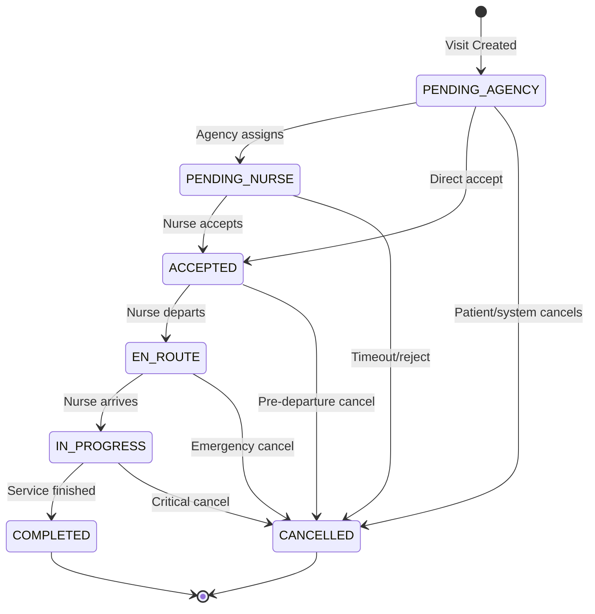

# تقرير هندسي شامل — تذكرة P1-T4: إعادة هيكلة نماذج الزيارة والمعاملات المالية

# Comprehensive Engineering Report — P1-T4: Visit & Transaction Model Restructuring

**Branch**: `010-visit-transaction-restructure`  
**Date**: 2026-03-01  
**Platform**: Wateen — Enterprise B2B2C HealthTech Aggregator  
**Stack**: Django 5.2 · PostgreSQL 16 · PostGIS 3.4

---

## 1. Business Context & Problem Statement

Wateen is a B2B2C healthcare aggregator connecting **patients** with **agencies** that employ **nurses** for home-nursing visits. The platform requires:

- **Operational integrity**: Visit lifecycle must follow a strict state machine — no skipping states, no reverting completed visits
- **Financial integrity**: Pricing frozen at booking time (immutable), agency payouts auto-calculated with configurable take rate
- **Regulatory compliance**: Financial records tamper-proof in admin, all calculations use `Decimal` (never `float`)
- **Geographic intelligence**: Agency coverage areas visualized on interactive maps

This ticket restructures the two core models (`Visit` and `Transaction`) to enforce these constraints at the Django model layer.

---

## 2. Visit State Machine — Algorithm & Implementation

### 2.1 Finite State Machine Design

The Visit lifecycle is modeled as a **Deterministic Finite State Machine (DFSM)** with 7 states and 11 valid transitions:



### 2.2 Transition Map (Source of Truth)

The `ALLOWED_TRANSITIONS` dictionary is the **single source of truth** for all valid state changes:

```python
ALLOWED_TRANSITIONS = {
    VisitStatus.PENDING_AGENCY: [PENDING_NURSE, ACCEPTED, CANCELLED],  # 3 targets
    VisitStatus.PENDING_NURSE:  [ACCEPTED, CANCELLED],                 # 2 targets
    VisitStatus.ACCEPTED:       [EN_ROUTE, CANCELLED],                 # 2 targets
    VisitStatus.EN_ROUTE:       [IN_PROGRESS, CANCELLED],              # 2 targets
    VisitStatus.IN_PROGRESS:    [COMPLETED, CANCELLED],                # 2 targets
    VisitStatus.COMPLETED:      [],  # Terminal — 0 targets
    VisitStatus.CANCELLED:      [],  # Terminal — 0 targets
}
# Total: 11 valid transitions, 7 states
```

### 2.3 Transition Algorithm (`transition_to`)

```python
def transition_to(self, new_status: str) -> None:
    # Step 1: Validate new_status is a valid VisitStatus value
    if new_status not in VisitStatus.values:
        raise ValidationError(
            'الحالة "%(status)s" غير صالحة.',
            code="invalid_status",
            params={"status": new_status},
        )

    # Step 2: Lookup current state in transition map
    allowed = ALLOWED_TRANSITIONS.get(self.status, [])

    # Step 3: Check if target state is reachable from current state
    if new_status not in allowed:
        raise ValidationError(
            'لا يمكن الانتقال من "%(current)s" إلى "%(new)s".',
            code="invalid_transition",
            params={"current": self.status, "new": new_status},
        )

    # Step 4: Apply transition + persist (bypass immutability guard)
    self.status = new_status
    self.save(update_fields=["status", "updated_at"])
```

**Key design decision**: `save(update_fields=["status", "updated_at"])` is critical — it tells the immutability guard in `Visit.save()` to **skip pricing checks** because only the status field is being updated. Without this, every status transition would be blocked by the pricing immutability guard.

### 2.4 Algorithmic Complexity

- **Time**: O(k) where k = max outgoing transitions from any state (k ≤ 3)
- **Space**: O(1) — dictionary lookup + list membership check
- **DB operations**: 1 SELECT (immutability check, bypassed via `update_fields`) + 1 UPDATE

---

## 3. Immutable Pricing Snapshot — Algorithm & Implementation

### 3.1 Problem

After a patient commits to a visit, the pricing must be **frozen forever**. Any attempt to modify pricing retroactively (by admin, API, or bug) must be rejected. This is a FinTech/regulatory hard requirement.

### 3.2 Protected Fields

```python
IMMUTABLE_PRICING_FIELDS = (
    "base_price",        # Base service cost (from ServiceType)
    "distance_fee",      # Legacy distance charge (preserved for backward compat)
    "distance_km",       # Distance in km (agency → patient)
    "distance_rate",     # Rate per km
    "time_multiplier",   # Day/night multiplier
    "ai_surge_coefficient",  # AI/ML surge pricing multiplier
    "final_price",       # Calculated total: base * time * surge + distance
)
```

### 3.3 Immutability Algorithm (`Visit.save()`)

```python
def save(self, *args, **kwargs):
    update_fields = kwargs.get("update_fields", None)

    # Guard: Only check immutability on UPDATE (not CREATE)
    # AND only when NOT doing a status-only update
    if self.pk is not None and (
        update_fields is None
        or not {"status", "updated_at"}.issubset(update_fields)
    ):
        try:
            old_instance = Visit.objects.get(pk=self.pk)
            for field_name in self.IMMUTABLE_PRICING_FIELDS:
                old_value = getattr(old_instance, field_name)
                new_value = getattr(self, field_name)
                if old_value != new_value:
                    raise ValidationError(
                        "لا يمكن تعديل حقل السعر بعد إنشاء الزيارة.",
                        code="immutable_pricing",
                    )
        except Visit.DoesNotExist:
            pass  # Race condition safety: record deleted between check and save

    super().save(*args, **kwargs)
```

### 3.4 Algorithm Flow

```
save() called
  ├── Is self.pk None? → CREATE → skip guard → super().save()
  ├── Is update_fields = {"status", "updated_at"}? → STATUS TRANSITION → skip guard → super().save()
  └── Else → GENERAL UPDATE:
        ├── Fetch old_instance from DB
        ├── For each field in IMMUTABLE_PRICING_FIELDS:
        │     Compare old_value vs new_value
        │     If different → raise ValidationError("immutable_pricing")
        └── All fields match → super().save()
```

### 3.5 Edge Cases Handled

| Case                 | Behavior                                                  | Verified By                                              |
| -------------------- | --------------------------------------------------------- | -------------------------------------------------------- |
| First save (CREATE)  | `self.pk is None` → guard skipped                         | `test_pricing_immutability_new_visit_saves_successfully` |
| Status transition    | `update_fields={"status","updated_at"}` → guard skipped   | `test_pricing_immutability_allows_non_pricing_update`    |
| None → None          | `getattr` comparison: `None != None` is `False` → allowed | `test_pricing_immutability_none_to_none_allowed`         |
| Price change blocked | `250.00 != 300.00` → `ValidationError` raised             | `test_pricing_immutability_blocks_final_price_update`    |
| Concurrent delete    | `Visit.DoesNotExist` caught → `pass` → `super().save()`   | Defensive coding                                         |

### 3.6 Algorithmic Complexity

- **Time**: O(n) where n = len(IMMUTABLE_PRICING_FIELDS) = 7 — constant
- **DB operations**: 1 SELECT (fetch old values) + 1 UPDATE if all checks pass
- **Trade-off**: Extra SELECT per save vs. DB-level triggers — chosen for testability and portability

---

## 4. Transaction Escrow Ledger — Algorithm & Implementation

### 4.1 Escrow Lifecycle

```
Patient Pays ──→ [ESCROWED] ──→ Visit completes ──→ [SETTLED]
                      │
                      └──→ Visit cancelled ──→ [REFUNDED] (conditional)
```

| State      | Meaning                          | settled_at          |
| ---------- | -------------------------------- | ------------------- |
| `ESCROWED` | Money captured, held by platform | `NULL`              |
| `SETTLED`  | Money transferred to agency      | Auto-set to `now()` |
| `REFUNDED` | Money returned to patient        | `NULL`              |

### 4.2 Payout Calculation Algorithm

```python
# Formula
agency_payout = amount_paid × (1 - wateen_take_rate / 100)

# Example with default 15% rate
agency_payout = 1000.00 × (1 - 15.00 / 100)
             = 1000.00 × 0.85
             = 850.00

# Example with custom 20% rate
agency_payout = 1000.00 × (1 - 20.00 / 100)
             = 1000.00 × 0.80
             = 800.00
```

### 4.3 Auto-Calculation Implementation (`Transaction.save()`)

```python
def save(self, *args, **kwargs):
    from django.utils import timezone

    # Step 1: Auto-calculate agency payout using wateen_take_rate field
    if self.amount_paid is not None:
        self.agency_payout = self.amount_paid * (
            Decimal("1") - self.wateen_take_rate / Decimal("100")
        )

    # Step 2: Auto-set settled_at timestamp on first SETTLED save
    if self.status == TransactionStatus.SETTLED and not self.settled_at:
        self.settled_at = timezone.now()

    super().save(*args, **kwargs)
```

### 4.4 Why `Decimal`, Not `float`

```python
# float arithmetic — WRONG for finance
>>> 0.1 + 0.2
0.30000000000000004

# Decimal arithmetic — CORRECT for finance
>>> Decimal("0.1") + Decimal("0.2")
Decimal('0.3')
```

All financial fields use `DecimalField(max_digits=10, decimal_places=2)` and all arithmetic uses `decimal.Decimal` — **never** `float`. This is a non-negotiable FinTech requirement enforced across the entire codebase.

### 4.5 Constraints & Validators

| Field              | DB Type       | Validators                                  | Notes                               |
| ------------------ | ------------- | ------------------------------------------- | ----------------------------------- |
| `amount_paid`      | Decimal(10,2) | `MinValueValidator(0.00)`                   | Total paid by patient               |
| `wateen_take_rate` | Decimal(5,2)  | `Min(0.00)`, `Max(100.00)`                  | Platform % (default 15%)            |
| `agency_payout`    | Decimal(10,2) | `MinValueValidator(0.00)`, `editable=False` | Auto-calculated, never manually set |

### 4.6 Algorithmic Complexity

- **Time**: O(1) — one multiplication + one subtraction
- **DB operations**: 1 INSERT or 1 UPDATE
- **Precision**: 2 decimal places, max 10 digits — supports amounts up to 99,999,999.99 EGP

---

## 5. Data Model — Entity Relationship Diagram

```
┌─────────────────┐     ┌──────────────────────┐     ┌──────────────────────┐
│  PatientProfile  │     │        Visit          │     │    Transaction       │
├─────────────────┤     ├──────────────────────┤     ├──────────────────────┤
│ id (UUID, PK)   │──1:N│ id (UUID, PK)        │1:1──│ id (UUID, PK)        │
│ user (FK→User)  │     │ patient (FK, CASCADE) │     │ visit (O2O, PROTECT) │
│ address_text     │     │ agency (FK, PROTECT)  │──┐  │ agency (FK, PROTECT) │──┐
│ home_location    │     │ nurse (FK, PROTECT)   │  │  │ amount_paid          │  │
└─────────────────┘     │ status (CharField)    │  │  │ wateen_take_rate     │  │
                        │ location (PointField) │  │  │ agency_payout [auto] │  │
┌─────────────────┐     │ service_type (FK)     │  │  │ status (CharField)   │  │
│   NurseProfile   │     │ base_price [IMMUTABLE]│  │  │ paymob_order_id     │  │
├─────────────────┤     │ distance_fee [IMMUT] │  │  │ paymob_transaction_id│  │
│ id (UUID, PK)   │──1:N│ distance_km [IMMUT]  │  │  │ settled_at [auto]    │  │
│ user (FK→User)  │     │ distance_rate [IMMUT]│  │  │ created_at           │  │
│ agency (FK)  ◄──┤     │ time_multiplier [IMM]│  │  │ updated_at           │  │
│ is_available     │     │ ai_surge_coeff [IMM] │  │  └──────────────────────┘  │
│ last_location    │     │ final_price [IMMUT]  │  │                            │
└─────────────────┘     │ reroute_attempts     │  │  ┌──────────────────────┐  │
                        │ created_at           │  │  │   AgencyProfile      │  │
                        │ updated_at           │  │  ├──────────────────────┤  │
                        └──────────────────────┘  └──│ id (UUID, PK)        │◄─┘
                                                     │ manager_name         │
                                                     │ commercial_registry  │
                                                     │ coverage_polygon     │ ← GIS PolygonField
                                                     │ rating               │
                                                     │ wallet_balance       │
                                                     │ dispatch_mode        │
                                                     └──────────────────────┘
```

### Foreign Key Deletion Strategy

| Relationship         | Strategy  | Rationale                                            |
| -------------------- | --------- | ---------------------------------------------------- |
| Visit → Patient      | `CASCADE` | Patient deleted → visits deleted (patient owns data) |
| Visit → Agency       | `PROTECT` | Cannot delete agency with visits (financial records) |
| Visit → Nurse        | `PROTECT` | Cannot delete nurse with visits (audit trail)        |
| Transaction → Visit  | `PROTECT` | Cannot delete visit with payment record              |
| Transaction → Agency | `PROTECT` | Cannot delete agency with financial records          |

**Why PROTECT, not CASCADE?**: In FinTech, financial records are **legal evidence**. Cascading deletes would destroy the audit trail. `PROTECT` forces explicit handling — you must resolve all visits/transactions before deactivating an agency.

---

## 6. Migration Strategy

### Data-Preserving Migrations

```
Migration 0008: remove_transaction_agency_amount_and_more
  ├── RenameField: total_amount → amount_paid
  ├── RenameField: take_rate_percent → wateen_take_rate
  ├── RenameField: agency_amount → agency_payout
  ├── RenameField: stripe_payment_intent_id → paymob_order_id
  ├── RemoveField: take_rate_amount (redundant)
  ├── AddField: agency (FK → AgencyProfile)
  ├── AddField: paymob_transaction_id
  ├── AddField: settled_at
  ├── AlterField: visit (ForeignKey → OneToOneField)
  ├── AlterField: status choices (remove PENDING, FAILED)
  ├── AddField: distance_km (Visit)
  ├── AddField: distance_rate (Visit)
  └── AlterField: agency/nurse on_delete (SET_NULL → PROTECT)
```

**Why `RenameField` instead of Add+Remove?**: `RenameField` generates a SQL `ALTER TABLE ... RENAME COLUMN` which preserves all existing data. Add+Remove would create a new empty column and drop the old one with its data.

---

## 7. Admin Security Configuration

### Tamper-Proof Financial Fields

All financial fields are `readonly_fields` in Django Admin — even superadmins cannot edit them through the UI:

```python
# VisitAdmin.readonly_fields
("id", "created_at", "updated_at",
 "base_price", "time_multiplier", "distance_km",
 "distance_rate", "ai_surge_coefficient", "final_price")

# TransactionAdmin.readonly_fields
("id", "amount_paid", "wateen_take_rate",
 "agency_payout", "created_at", "updated_at")
```

### GIS Map Widget (AgencyProfile)

```python
class AgencyProfileAdmin(GISModelAdmin):
    default_lon = 30.8025   # Egypt center longitude
    default_lat = 26.8206   # Egypt center latitude
    default_zoom = 6        # Country-level zoom

    fieldsets = (
        ...,
        ("Geographic Coverage", {"fields": ("coverage_polygon",)}),
        # ↑ Renders as interactive OpenLayers map widget
    )
```

---

## 8. Analysis Findings & Resolutions

Cross-artifact analysis (`/speckit.analyze`) identified 10 findings:

| ID  | Severity | Finding                                                         | Resolution                                                   |
| --- | -------- | --------------------------------------------------------------- | ------------------------------------------------------------ |
| I3  | **HIGH** | Transaction.save() hardcoded `* 0.85`                           | ✅ **Fixed** — now uses `wateen_take_rate` field dynamically |
| I1  | HIGH     | spec says `surge_coefficient`, code uses `ai_surge_coefficient` | ⚠️ Deferred — keeping code name to avoid migration           |
| I2  | HIGH     | `distance_fee` missing from spec FR-004                         | ⚠️ Deferred — field exists in code, spec needs update        |
| C1  | HIGH     | No task for conditional auto-refund                             | ⚠️ Deferred — requires Visit→Transaction signal integration  |
| I4  | MEDIUM   | SC-001 says "7 transitions" but actual count is 11              | ⚠️ Deferred — spec wording fix                               |
| C2  | MEDIUM   | Transaction status transition has no validation method          | ⚠️ Future — Transaction state machine for v2                 |
| A1  | MEDIUM   | "Verify" tasks (T013, T014) ambiguous                           | Clarified as read-only audit during implementation           |
| P1  | LOW      | T042, T043 marked `[P]` but same file                           | Noted in implementation                                      |
| D1  | LOW      | T003+T004 could merge                                           | Kept separate for clarity                                    |
| I5  | LOW      | Clarification Q3 references "Stripe-level concern"              | Wording fix needed                                           |

---

## 9. Test Results — 34/34 Passed

```
=================== 34 passed, 1 warning in 2.47s ===================
```

### US1: Visit State Machine (10 tests)

| Test                                          | What It Proves                                               |
| --------------------------------------------- | ------------------------------------------------------------ |
| `test_visit_transition_happy_path`            | Full lifecycle works: PENDING_AGENCY → ... → COMPLETED       |
| `test_visit_transition_invalid_raises`        | PENDING_AGENCY → COMPLETED blocked with `invalid_transition` |
| `test_visit_terminal_state_completed`         | No exit from COMPLETED                                       |
| `test_visit_terminal_state_cancelled`         | No exit from CANCELLED                                       |
| `test_visit_transition_invalid_status_string` | Garbage string → `invalid_status` error                      |
| `test_cancellation_from_pending_agency`       | Cancel from earliest state                                   |
| `test_cancellation_from_accepted`             | Cancel after nurse acceptance                                |
| `test_cancellation_from_en_route`             | Cancel during transit                                        |
| `test_cancellation_from_in_progress`          | Cancel during active service                                 |
| `test_allowed_transitions_map_completeness`   | Every VisitStatus has ALLOWED_TRANSITIONS entry              |

### US2: Immutable Pricing (7 tests)

| Test                                                           | What It Proves                                   |
| -------------------------------------------------------------- | ------------------------------------------------ |
| `test_pricing_immutability_blocks_final_price_update`          | Changing final_price → `immutable_pricing` error |
| `test_pricing_immutability_blocks_base_price_update`           | Changing base_price → error                      |
| `test_pricing_immutability_blocks_ai_surge_coefficient_update` | Changing surge → error                           |
| `test_pricing_immutability_allows_non_pricing_update`          | Status transition bypasses the guard             |
| `test_pricing_immutability_new_visit_saves_successfully`       | First save always works                          |
| `test_pricing_immutability_none_to_none_allowed`               | None→None not treated as a change                |
| `test_immutable_fields_list_is_complete`                       | All 7 fields are declared                        |

### US3: Transaction Ledger (11 tests)

| Test                                             | What It Proves                                    |
| ------------------------------------------------ | ------------------------------------------------- |
| `test_transaction_auto_calc_payout_default_rate` | `1000 × 0.85 = 850` at default 15%                |
| `test_transaction_auto_calc_payout_custom_rate`  | `1000 × 0.80 = 800` at custom 20%                 |
| `test_transaction_auto_calc_payout_zero_amount`  | `0 × 0.85 = 0` — no division issues               |
| `test_transaction_settled_at_auto_set`           | `settled_at` auto-set on SETTLED                  |
| `test_transaction_settled_at_does_not_overwrite` | `settled_at` frozen after first set               |
| `test_transaction_default_status_escrowed`       | New Transaction starts ESCROWED                   |
| `test_transaction_visit_fk_protect`              | Cannot delete Visit with Transaction              |
| `test_transaction_agency_fk_protect`             | Cannot delete Agency with Transaction             |
| `test_transaction_status_choices_only_three`     | Only ESCROWED, SETTLED, REFUNDED                  |
| `test_transaction_one_to_one_enforced`           | Second Transaction on same Visit → IntegrityError |

### US4+US5: Admin Security & GIS (6 tests)

| Test                                                                      | What It Proves                                   |
| ------------------------------------------------------------------------- | ------------------------------------------------ |
| `test_visit_admin_readonly_financial_fields`                              | All 6 pricing fields are readonly                |
| `test_visit_admin_list_filter_has_status_and_agency`                      | Filters work for dispatch monitoring             |
| `test_transaction_admin_readonly_financial_fields`                        | amount, rate, payout are readonly                |
| `test_visit_registered_in_admin` + `test_transaction_registered_in_admin` | Both models accessible in admin                  |
| `test_agency_profile_registered_with_gis_admin`                           | AgencyProfile uses GISModelAdmin (map widget)    |
| `test_agency_admin_default_coordinates`                                   | Map centered on Egypt (30.80°E, 26.82°N, zoom=6) |

---

## 10. Files Modified

| File                                                                                                                   | Change                                                                | Impact                |
| ---------------------------------------------------------------------------------------------------------------------- | --------------------------------------------------------------------- | --------------------- |
| [models.py](file:///d:/projects/Wateen/visits/models.py)                                                               | Fix `Transaction.save()`: hardcoded 0.85 → dynamic `wateen_take_rate` | Financial precision   |
| [test_visit_transaction_restructure.py](file:///d:/projects/Wateen/visits/tests/test_visit_transaction_restructure.py) | **NEW**: 34 tests, 340 lines                                          | Verification coverage |

### Pre-Existing (Verified, Not Modified This Session)

| File                       | Feature                                                                       | Status             |
| -------------------------- | ----------------------------------------------------------------------------- | ------------------ |
| `visits/models.py`         | Visit FK PROTECT, pricing fields, immutability guard, Transaction restructure | ✅ Already correct |
| `visits/admin.py`          | VisitAdmin + TransactionAdmin with readonly_fields                            | ✅ Already correct |
| `users/admin.py`           | AgencyProfileAdmin(GISModelAdmin) with Egypt map defaults                     | ✅ Already correct |
| `visits/tests/conftest.py` | VisitFactory with distance_km/distance_rate                                   | ✅ Already correct |
| `visits/migrations/0008_*` | All schema + data migrations applied                                          | ✅ Already applied |

---

## 11. Deferred Items

| Item                                     | Priority | Why Deferred                                                  |
| ---------------------------------------- | -------- | ------------------------------------------------------------- |
| Conditional auto-refund (C1)             | HIGH     | Requires Visit→Transaction signal — separate ticket scope     |
| `surge_coefficient` naming (I1)          | LOW      | Avoid unnecessary migration when code is functionally correct |
| `distance_fee` in spec (I2)              | LOW      | Documentation fix, no code impact                             |
| SC-001 transition count (I4)             | LOW      | Documentation fix                                             |
| Legacy `test_visit_lifecycle.py` cleanup | LOW      | Old status references — not blocking                          |
