# 🏥 Wateen (وَتِين) — Master Implementation Plan v3.2

> **Version:** 3.2 — February 2026
> **Edition:** AI-Native Solo Operator  
> **Target Market:** Egypt (Arabic-first, RTL)  
> **Architecture:** Modular Monolith → Micro-ready with Advanced Features Integration  
> **Execution Model:** Hyper-Pair Programming — Solo Dev + AI

---

## Table of Contents

1. [Executive Summary](#1-executive-summary)
2. [الهيكلية التقنية (Architecture)](#2-الهيكلية-التقنية-architecture)
3. [المنطق الأساسي (The 'Uber' Logic)](#3-المنطق-الأساسي-the-uber-logic)
4. [Database Schema Strategy](#4-database-schema-strategy)
5. [20-Phase Implementation Roadmap](#5-20-phase-implementation-roadmap)
6. [Egyptian Market Considerations](#6-egyptian-market-considerations)
7. [Risk Management & Security](#7-risk-management--security)

---

## 1. Executive Summary

Wateen represents a transformative leap in healthcare delivery for Egypt, evolving from a standard on-demand nursing service to a comprehensive healthcare ecosystem. This Master Implementation Plan v3.1 integrates core platform functionality with nine advanced features spanning IoT, AI, and blockchain technologies.

### 1.1 Vision & Strategic Objectives

**Primary Vision:** Establish Wateen as Egypt's leading digital healthcare platform, combining immediate nursing care with advanced health monitoring, AI-powered clinical support, and blockchain-secured health records.

**Execution Model: Hyper-Pair Programming**

This plan is engineered for a team of **two**: ONE Human Lead (The User) and ONE AI Technical Engine (Wateen Gem I). All development follows a sequential, high-velocity model where the Human Lead drives product decisions, architecture validation, and deployment, while the AI Technical Engine handles code generation, boilerplate scaffolding, testing, documentation, and rapid iteration. The timeline remains the same as the original 48-week roadmap, but execution is sequential and high-velocity rather than parallelized across a large team.

**Strategic Objectives:**

- Achieve 15% market share in Cairo within 12 months
- Reduce average emergency response time by 40% through predictive analytics
- Improve patient outcomes through continuous monitoring and AI clinical support
- Create the first blockchain-secured, patient-controlled health wallet in Egypt

### 1.2 Technical Innovation Highlights

1. **IoT Integration**: Real-time vitals monitoring through wearables
2. **AI Copilot**: Medical decision support with Arabic NLP
3. **Blockchain Security**: Immutable audit trails and patient-controlled data
4. **Predictive Analytics**: Epidemic detection and demand forecasting
5. **Hyper-Local Navigation**: Addressing Egypt's unstructured addressing challenges

### 1.3 Market Opportunity

Egypt's healthcare market presents unique challenges that Wateen is positioned to solve:

- **Infrastructure Gaps**: 60% of areas lack reliable addressing
- **Healthcare Access**: 2.5 doctors per 1,000 citizens (vs. 3.5 global average)
- **Mobile Penetration**: 95% smartphone adoption with 70% 4G coverage
- **Digital Payments**: Rapid shift from cash (60%) to digital (40% and growing)

---

## 2. الهيكلية التقنية (Architecture)

### 2.1 Architecture Decision: **Modular Monolith → Micro-ready with Advanced Features**

For a **Hyper-Pair Programming** execution model (Solo Dev + AI) operating over 48 weeks, we adopt a **Modular Monolith** with clear domain boundaries, designed for future decomposition while supporting advanced feature integration. The Solo Dev + AI model enables high-velocity, sequential development where each module is built, tested, and validated before moving to the next, ensuring zero context-switching overhead and deep architectural consistency across the entire codebase.

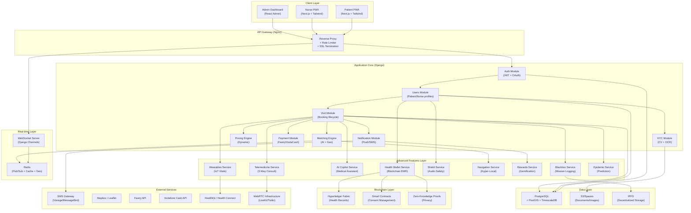

### 2.2 Tech Stack Summary

| Layer                        | Technology                                            | Rationale                                        |
| ---------------------------- | ----------------------------------------------------- | ------------------------------------------------ |
| **Frontend — Patient/Nurse** | Next.js 14 (App Router), Tailwind CSS, PWA (next-pwa) | SSR for SEO, offline-first PWA, mobile-first     |
| **Frontend — Admin**         | React Admin + Recharts                                | Rapid CRUD dashboard development                 |
| **Backend API**              | Django 5 + Django REST Framework                      | Mature, batteries-included, strong ORM           |
| **Real-time**                | Django Channels + Redis (Pub/Sub)                     | Native Django WebSocket support                  |
| **Database**                 | PostgreSQL 16 + PostGIS 3.4 + TimescaleDB             | Spatial queries, time-series optimization        |
| **Cache / Geo-Index**        | Redis 7 (GEOADD/GEOSEARCH)                            | Sub-ms nurse lookups by location                 |
| **AI / ML**                  | Python + Scikit-learn + Pandas + spaCy (Arabic)       | Lightweight models with Arabic NLP support       |
| **Computer Vision**          | OpenCV + Tesseract OCR + face_recognition             | Offline-capable ID verification                  |
| **Blockchain**               | Hyperledger Fabric + Smart Contracts                  | Permissioned blockchain for healthcare           |
| **Object Storage**           | DigitalOcean Spaces (S3-compatible) + IPFS            | Cost-effective for Egypt + decentralized storage |
| **Containerization**         | Docker + Docker Compose                               | Consistent dev/prod environments                 |
| **Reverse Proxy**            | Nginx                                                 | SSL, rate-limiting, static serving               |
| **CI/CD**                    | GitHub Actions                                        | Free tier, well-integrated                       |
| **Server OS**                | Fedora Server                                         | Operator preference                                  |

### 2.3 Data Flow: "Enhanced Visit Request" Scenario

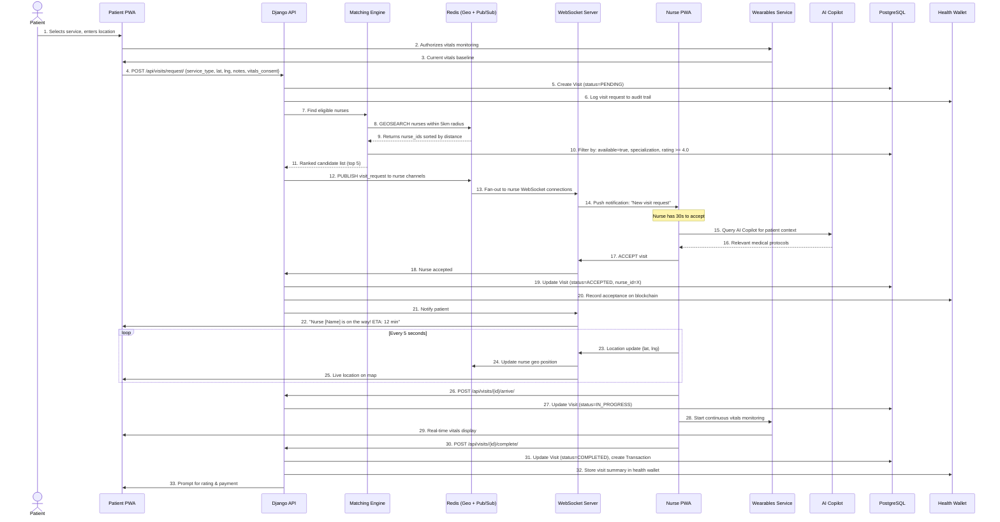

---

## 3. المنطق الأساسي (The 'Uber' Logic)

### 3.1 Enhanced Real-time Dispatching System

**Architecture:** Django Channels + Redis Pub/Sub + AI-powered Matching

```
Channel Groups:
├── nurse_{nurse_id}          # Personal channel per nurse
├── visit_{visit_id}          # Shared channel: patient + assigned nurse
├── zone_{geohash_prefix}     # Geo-zone broadcast (e.g., zone_scy8g)
├── admin_dashboard            # Ops monitoring feed
├── wearables_{patient_id}     # Real-time vitals streaming
└── ai_copilot_{nurse_id}     # AI assistance channel
```

**Enhanced Dispatch Algorithm (AI-Powered Broadcast-Accept Model):**

1. Patient creates visit request with optional vitals consent
2. Matching Engine queries Redis `GEOSEARCH` for nurses within configurable radius
3. AI-powered candidate filtering:
   - **Base filters**: `is_available`, `specializations`, `rating >= threshold`, `not_blacklisted`
   - **AI filters**: Historical performance, patient compatibility, workload balance
4. Candidates ranked by enhanced composite score:
   ```
   score = (0.3 × proximity_score) +
           (0.25 × rating_score) +
           (0.2 × experience_score) +
           (0.15 × response_rate) +
           (0.1 × ai_compatibility_score)
   ```
5. Top-N nurses receive simultaneous WebSocket push with patient context
6. **First-Accept-Wins** with 30-second timeout
7. If no acceptance → expand radius by 3km, repeat (max 3 rounds)
8. If still unmatched → queue request, notify patient of delay, alert admin

**Timeout & Fallback Logic:**

| Round | Radius | Timeout | Max Candidates           | AI Features            |
| ----- | ------ | ------- | ------------------------ | ---------------------- |
| 1     | 5 km   | 30s     | 5                        | Basic matching         |
| 2     | 8 km   | 30s     | 8                        | Workload consideration |
| 3     | 15 km  | 45s     | 10                       | Full AI scoring        |
| 4     | —      | —       | Manual dispatch by admin | Human override         |

### 3.2 Advanced Geospatial Logic with Hyper-Local Navigation

**Core Spatial Operations (PostGIS + Redis + Custom Maps):**

```sql
-- Find nurses within radius (PostGIS fallback for complex queries)
SELECT n.id, n.full_name, n.rating,
       ST_Distance(n.last_location::geography,
                   ST_MakePoint(:lng, :lat)::geography) AS distance_m
FROM nurses_nurseprofile n
WHERE ST_DWithin(n.last_location::geography,
                 ST_MakePoint(:lng, :lat)::geography, :radius_m)
  AND n.is_available = true
  AND n.is_verified = true
ORDER BY distance_m ASC;
```

```python
# Redis for hot-path geo lookups (sub-millisecond)
redis.geoadd("active_nurses", lng, lat, f"nurse:{nurse_id}")
nearby = redis.geosearch("active_nurses", longitude=lng, latitude=lat,
                          radius=5, unit="km", sort="ASC", count=10)
```

**Enhanced ETA Calculation with Traffic & Navigation:**

```python
def calculate_eta(nurse_location, patient_location, time_of_day):
    """
    Egypt-adjusted ETA calculation with navigation optimization.
    Uses Haversine distance + traffic multiplier + route optimization.
    """
    straight_distance_km = haversine(nurse_location, patient_location)

    # Cairo road factor: streets are ~1.4x longer than straight-line
    road_distance_km = straight_distance_km * 1.4

    # Average speed by time of day (km/h) - Cairo traffic model
    hour = time_of_day.hour
    if 7 <= hour <= 10 or 16 <= hour <= 20:  # Rush hours
        avg_speed = 12
    elif 22 <= hour or hour <= 5:  # Night
        avg_speed = 35
    else:  # Normal
        avg_speed = 20

    # Navigation optimization factor
    navigation_factor = get_navigation_optimization(nurse_location, patient_location)

    eta_minutes = (road_distance_km / avg_speed) * 60 * navigation_factor
    return max(5, round(eta_minutes))  # Minimum 5 min ETA
```

**Hyper-Local Address Resolution:**

```python
def resolve_address(text_address, landmarks, patient_location):
    """
    Advanced address resolution for Egypt's unstructured addressing.
    Combines text matching, landmark references, and GPS coordinates.
    """
    # Step 1: Extract building identifiers
    building_info = extract_building_details(text_address)

    # Step 2: Match against crowd-sourced pins
    nearby_pins = query_location_pins(patient_location, radius=100)

    # Step 3: Apply fuzzy matching for landmarks
    landmark_matches = fuzzy_match_landmarks(landmarks, nearby_pins)

    # Step 4: Geocode with fallback to manual coordinates
    if landmark_matches:
        return landmark_matches[0].coordinates
    else:
        return geocode_with_confidence(text_address, patient_location)
```

### 3.3 Dynamic Pricing Engine with AI Optimization

**Enhanced Price Formula:**

```
final_price = base_price × service_multiplier × surge_multiplier ×
              distance_adder + night_premium + ai_demand_adjustment
```

| Factor                   | Logic                                        | AI Enhancement                |
| ------------------------ | -------------------------------------------- | ----------------------------- |
| **base_price**           | Per-service base (e.g., injection = 150 EGP) | Historical pricing data       |
| **service_multiplier**   | Complexity factor (1.0 → 2.5)                | Patient condition complexity  |
| **surge_multiplier**     | Demand/supply ratio in zone                  | Predictive demand forecasting |
| **distance_adder**       | +10 EGP per km beyond 3km base               | Route optimization discounts  |
| **night_premium**        | +50 EGP flat fee for 10 PM – 6 AM            | Area safety adjustments       |
| **ai_demand_adjustment** | ML-based demand prediction                   | Event-based pricing           |

**AI-Powered Surge Pricing:**

```python
def calculate_ai_surge(zone_id: str, time_of_day: datetime) -> float:
    """
    AI-enhanced surge calculation using predictive models.
    """
    # Base demand/supply ratio
    active_requests = redis.get(f"zone:{zone_id}:active_requests") or 0
    available_nurses = redis.get(f"zone:{zone_id}:available_nurses") or 1
    demand_ratio = active_requests / max(available_nurses, 1)

    # AI demand prediction
    predicted_demand = ai_predict_demand(zone_id, time_of_day)
    demand_factor = predicted_demand / max(active_requests, 1)

    # Event-based adjustments
    event_multiplier = get_event_multiplier(zone_id, time_of_day)

    # Calculate final surge
    base_surge = calculate_base_surge(demand_ratio)
    ai_adjustment = min(demand_factor, 2.0)  # Cap at 2x
    final_surge = base_surge * ai_adjustment * event_multiplier

    return min(final_surge, 2.5)  # Regulatory cap
```

### 3.4 AI-Enhanced Trust System — Advanced KYC Workflow

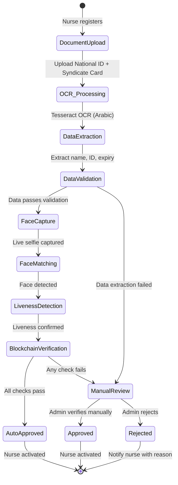

**Enhanced Verification Steps:**

| Step                           | Technology                   | AI Enhancement             |
| ------------------------------ | ---------------------------- | -------------------------- |
| **1. Document Upload**         | PWA Camera API + S3          | Quality assessment AI      |
| **2. Image Preprocessing**     | OpenCV                       | Automated enhancement      |
| **3. OCR Extraction**          | Tesseract (Arabic + English) | Context-aware extraction   |
| **4. Data Validation**         | Python regex + rules         | Cross-document validation  |
| **5. Face Capture**            | PWA MediaStream API          | Liveness detection AI      |
| **6. Face Matching**           | Face recognition (dlib)      | Deep learning models       |
| **7. Blockchain Verification** | Smart contracts              | Immutable credential check |
| **8. Decision**                | Business logic               | AI confidence scoring      |

### 3.5 Wearables Integration — Real-time Health Monitoring

**Vitals Processing Pipeline:**

```python
def process_vitals_stream(patient_id, vitals_data):
    """
    Real-time vitals processing with anomaly detection.
    """
    # Step 1: Validate incoming data
    validated_vitals = validate_vitals(vitals_data)

    # Step 2: Store in time-series database
    timeseries_store.insert(patient_id, validated_vitals)

    # Step 3: Anomaly detection
    anomalies = detect_anomalies(patient_id, validated_vitals)

    # Step 4: Alert processing
    if anomalies:
        trigger_alerts(patient_id, anomalies)
        notify_assigned_nurse(patient_id, anomalies)

    # Step 5: Update patient baseline
    update_patient_baseline(patient_id, validated_vitals)

    return {
        'status': 'processed',
        'anomalies': anomalies,
        'alerts_sent': len(anomalies)
    }
```

**Alert Thresholds (Customizable per Patient):**

| Vital              | Normal Range      | Alert Level 1    | Alert Level 2    | Alert Level 3 |
| ------------------ | ----------------- | ---------------- | ---------------- | ------------- |
| **Heart Rate**     | 60-100 bpm        | 50-59 or 101-110 | 40-49 or 111-130 | <40 or >130   |
| **Blood Pressure** | 90-140/60-90 mmHg | 140-159/90-99    | 160-179/100-109  | ≥180/110      |
| **SpO2**           | 95-100%           | 91-94%           | 86-90%           | <86%          |
| **Temperature**    | 36.1-37.2°C       | 37.3-38.0°C      | 38.1-39.0°C      | >39.0°C       |

### 3.6 AI Copilot — Medical Decision Support

**Clinical Decision Support Architecture:**

```python
class AICopilotService:
    def __init__(self):
        self.nlp_processor = ArabicNLPProcessor()
        self.medical_llm = FineTunedMedicalLLM()
        self.rule_engine = MedicalRuleEngine()
        self.dosage_calculator = DosageCalculator()

    def process_query(self, nurse_id, query, patient_context):
        """
        Process nurse query with patient context.
        """
        # Step 1: Intent classification
        intent = self.nlp_processor.classify_intent(query)

        # Step 2: Extract medical entities
        entities = self.nlp_processor.extract_entities(query)

        # Step 3: Retrieve relevant knowledge
        knowledge = self.retrieve_medical_knowledge(intent, entities)

        # Step 4: Generate response
        if intent == 'dosage':
            response = self.dosage_calculator.calculate(entities, patient_context)
        elif intent == 'interaction':
            response = self.check_drug_interactions(entities)
        elif intent == 'protocol':
            response = self.get_medical_protocol(entities)
        else:
            response = self.medical_llm.generate_response(query, knowledge)

        # Step 5: Safety validation
        validated_response = self.rule_engine.validate_response(response)

        # Step 6: Log interaction
        self.log_interaction(nurse_id, query, validated_response)

        return validated_response
```

**Supported Query Types:**

1. **Drug Dosage Calculations**: Age, weight, and condition-based dosing
2. **Drug Interaction Checks**: Multi-drug interaction analysis
3. **Medical Protocols**: Evidence-based clinical guidelines
4. **Symptom Assessment**: Preliminary assessment guidance
5. **Emergency Procedures**: Step-by-step emergency instructions

### 3.7 Blockchain-Enabled Health Wallet

**Patient-Controlled Health Records:**

```python
class HealthWalletService:
    def __init__(self):
        self.blockchain = HyperledgerFabricClient()
        self.ipfs = IPFSClient()
        self.zkp = ZeroKnowledgeProofProcessor()

    def create_health_wallet(self, patient_id):
        """
        Create patient-controlled health wallet.
        """
        # Step 1: Generate blockchain identity
        wallet_address = self.blockchain.create_identity()
        did = self.generate_did(wallet_address)

        # Step 2: Create wallet record
        wallet = HealthWallet.objects.create(
            patient_id=patient_id,
            blockchain_address=wallet_address,
            did=did,
            public_key=self.generate_key_pair()
        )

        # Step 3: Initialize smart contracts
        self.blockchain.deploy_contracts(wallet_address)

        return wallet

    def add_health_record(self, wallet_id, record_data, consent_level):
        """
        Add health record with patient consent.
        """
        # Step 1: Encrypt record
        encrypted_data = self.encrypt_record(record_data)

        # Step 2: Store on IPFS
        ipfs_hash = self.ipfs.store(encrypted_data)

        # Step 3: Create blockchain transaction
        tx_hash = self.blockchain.add_record(
            wallet_id=wallet_id,
            record_hash=ipfs_hash,
            consent_level=consent_level
        )

        # Step 4: Update local database
        record = HealthRecord.objects.create(
            wallet_id=wallet_id,
            content_hash=ipfs_hash,
            blockchain_tx_hash=tx_hash,
            consent_level=consent_level
        )

        return record
```

**Consent Management:**

| Consent Type        | Duration | Access Level       | Revocation |
| ------------------- | -------- | ------------------ | ---------- |
| **Emergency**       | 24 hours | Full access        | Automatic  |
| **Visit-specific**  | 7 days   | Visit-related only | Patient    |
| **Provider access** | 30 days  | Specific provider  | Patient    |
| **Research**        | 1 year   | Anonymized only    | Patient    |

---

## 4. Database Schema Strategy

### 4.1 Enhanced Entity Relationship Diagram

```mermaid
erDiagram
    USER ||--o| PATIENT_PROFILE : has
    USER ||--o| NURSE_PROFILE : has
    USER ||--o| DOCTOR_PROFILE : has
    USER {
        uuid id PK
        string phone_number UK
        string email
        string password_hash
        enum role "patient|nurse|doctor|admin"
        boolean is_active
        boolean is_verified
        timestamp created_at
    }

    PATIENT_PROFILE {
        uuid id PK
        uuid user_id FK
        string full_name
        date date_of_birth
        enum gender
        text address_text
        geometry home_location "POINT"
        text medical_notes
        string emergency_contact
        uuid wallet_id FK
        boolean wearables_enabled
        jsonb health_preferences
    }

    NURSE_PROFILE {
        uuid id PK
        uuid user_id FK
        string full_name_ar
        string full_name_en
        string national_id UK
        string syndicate_number UK
        date syndicate_expiry
        jsonb specializations "array"
        float rating "default 5.0"
        int total_visits
        int years_experience
        boolean is_available
        geometry last_location "POINT"
        enum verification_status "pending|approved|rejected"
        timestamp last_location_update
        boolean shield_enabled
        int reward_points
    }

    DOCTOR_PROFILE {
        uuid id PK
        uuid user_id FK
        string full_name_ar
        string full_name_en
        string specialization
        string license_number
        boolean is_available
        decimal hourly_rate
        decimal consultation_fee
        float rating "default 5.0"
    }

    NURSE_PROFILE ||--o{ NURSE_DOCUMENT : uploads
    NURSE_DOCUMENT {
        uuid id PK
        uuid nurse_id FK
        enum document_type "national_id|syndicate_card|selfie"
        string file_url
        jsonb ocr_data
        float face_match_score
        enum status "pending|verified|rejected"
        timestamp uploaded_at
    }

    PATIENT_PROFILE ||--o{ VISIT : requests
    NURSE_PROFILE ||--o{ VISIT : serves
    VISIT {
        uuid id PK
        string visit_number UK "SHL-2026-XXXXX"
        uuid patient_id FK
        uuid nurse_id FK "nullable"
        uuid doctor_id FK "nullable"
        enum service_type
        text description
        geometry patient_location "POINT"
        text address_text
        enum status "pending|matched|accepted|en_route|arrived|in_progress|completed|cancelled"
        decimal base_price
        decimal surge_multiplier
        decimal final_price
        timestamp requested_at
        timestamp accepted_at
        timestamp arrived_at
        timestamp started_at
        timestamp completed_at
        text cancellation_reason
        boolean wearables_consent
        boolean blackbox_consent
        uuid telemedicine_consult_id FK
    }

    VISIT ||--o| TRANSACTION : generates
    TRANSACTION {
        uuid id PK
        uuid visit_id FK
        uuid patient_id FK
        uuid nurse_id FK
        decimal amount
        enum payment_method "cash|fawry|vodafone_cash|card"
        enum status "pending|completed|refunded|failed"
        string gateway_ref
        timestamp created_at
    }

    VISIT ||--o| REVIEW : receives
    REVIEW {
        uuid id PK
        uuid visit_id FK
        uuid reviewer_id FK
        uuid reviewee_id FK
        int rating "1-5"
        text comment
        timestamp created_at
    }

    NURSE_PROFILE ||--o{ LOCATION_LOG : tracks
    LOCATION_LOG {
        bigint id PK
        uuid nurse_id FK
        geometry location "POINT"
        float speed
        float heading
        timestamp recorded_at
    }

    SERVICE_TYPE {
        uuid id PK
        string name_ar
        string name_en
        text description
        decimal base_price
        float complexity_multiplier
        boolean requires_specialization
        string required_specialization
    }

    ZONE {
        uuid id PK
        string name
        geometry boundary "POLYGON"
        boolean is_active
        float surge_multiplier_override
    }

    HEALTH_WALLET {
        uuid id PK
        uuid patient_id FK
        string blockchain_address
        string did
        text public_key
        timestamp created_at
        boolean is_active
    }

    HEALTH_RECORD {
        uuid id PK
        uuid wallet_id FK
        enum record_type "diagnosis|prescription|lab_result|imaging"
        string title
        string content_hash
        uuid provider_id
        timestamp recorded_at
        string blockchain_tx_hash
        boolean is_encrypted
    }

    WEARABLE_DEVICE {
        uuid id PK
        uuid patient_id FK
        string device_type
        string device_identifier
        boolean is_active
        timestamp authorized_at
        timestamp last_sync
    }

    VITALS_READING {
        bigint id PK
        uuid patient_id FK
        uuid device_id FK
        string reading_type
        decimal value
        string unit
        timestamp recorded_at
        timestamp received_at
        boolean is_anomaly
    }

    BLACKBOX_SESSION {
        uuid id PK
        uuid visit_id FK
        string patient_consent_hash
        string nurse_consent_hash
        timestamp started_at
        timestamp ended_at
        string status
        string encryption_key_id
        int retention_days
    }

    AI_COPILOT_INTERACTION {
        uuid id PK
        uuid nurse_id FK
        uuid visit_id FK
        string query_type
        text query_text
        text response_text
        decimal confidence_score
        jsonb sources
        boolean was_helpful
        text feedback_text
        timestamp created_at
    }

    REWARD_PROFILE {
        uuid id PK
        uuid patient_id FK
        int total_points
        int current_level
        boolean is_opted_in
        boolean is_public_leaderboard
        timestamp created_at
        timestamp updated_at
    }

    TELEMEDICINE_CONSULTATION {
        uuid id PK
        uuid visit_id FK
        uuid patient_id FK
        uuid nurse_id FK
        uuid doctor_id FK
        string room_name
        string status
        timestamp scheduled_at
        timestamp started_at
        timestamp ended_at
        boolean recording_consent
        string recording_url
        timestamp created_at
    }
```

### 4.2 Advanced Indexing Strategy

| Table                    | Index                                              | Type              | Purpose                      |
| ------------------------ | -------------------------------------------------- | ----------------- | ---------------------------- |
| `nurse_profile`          | `last_location`                                    | GiST (PostGIS)    | Spatial proximity queries    |
| `nurse_profile`          | `(is_available, is_verified, verification_status)` | B-tree composite  | Fast availability filtering  |
| `visit`                  | `(status, requested_at)`                           | B-tree composite  | Active visit lookups         |
| `visit`                  | `patient_id`, `nurse_id`                           | B-tree            | History queries              |
| `location_log`           | `(nurse_id, recorded_at)`                          | B-tree composite  | Route replay, sorted by time |
| `location_log`           | `location`                                         | GiST              | Spatial analysis             |
| `transaction`            | `(status, created_at)`                             | B-tree composite  | Financial reporting          |
| `review`                 | `reviewee_id`                                      | B-tree            | Rating aggregation           |
| `user`                   | `phone_number`                                     | Unique B-tree     | Login lookup                 |
| `vitals_reading`         | `(patient_id, recorded_at)`                        | B-tree composite  | Time-series queries          |
| `vitals_reading`         | `recorded_at`                                      | BRIN (PostgreSQL) | Time-series partitioning     |
| `health_record`          | `wallet_id`                                        | B-tree            | Wallet queries               |
| `health_record`          | `content_hash`                                     | Hash              | IPFS lookups                 |
| `blackbox_session`       | `visit_id`                                         | B-tree            | Session lookups              |
| `ai_copilot_interaction` | `(nurse_id, created_at)`                           | B-tree composite  | Interaction history          |

> [!TIP]
> **Partitioning Strategy:**
>
> - `location_log` partitioned by month (`recorded_at`)
> - `vitals_reading` partitioned by patient_id and month
> - `transaction` partitioned by year for financial reporting

---

## 5. 20-Phase Implementation Roadmap

### 5.1 Phase Overview

| Phase         | Duration    | Primary Focus            | Key Features                                | Execution Strategy |
| ------------- | ----------- | ------------------------ | ------------------------------------------- | ------------------ |
| **Phase 1-4** | Weeks 1-16  | Core Platform            | Basic visit flow, matching, payments        | Solo Dev + AI      |
| **Phase 5**   | Weeks 17-18 | IoT Foundation           | Wearables Integration (Basic)               | Solo Dev + AI      |
| **Phase 6**   | Weeks 19-20 | Location Services        | Hyper-Local Navigation (Basic)              | Solo Dev + AI      |
| **Phase 7**   | Weeks 21-22 | AI & Gamification        | AI Copilot (Basic), Health Rewards (Basic)  | Solo Dev + AI      |
| **Phase 8**   | Weeks 23-24 | Safety & Security        | Blackbox (Basic), Shield (Basic)            | Solo Dev + AI      |
| **Phase 9**   | Weeks 25-26 | Blockchain               | Health Wallet (Basic), Epidemic (Basic)     | Solo Dev + AI      |
| **Phase 10**  | Weeks 27-28 | Telemedicine             | Hybrid Telemedicine (Basic)                 | Solo Dev + AI      |
| **Phase 11**  | Weeks 29-30 | Advanced AI              | AI Copilot (Full), Shield (Advanced)        | Solo Dev + AI      |
| **Phase 12**  | Weeks 31-32 | Advanced Blockchain      | Health Wallet (Full), Rewards (Marketplace) | Solo Dev + AI      |
| **Phase 13**  | Weeks 33-34 | Advanced Telemedicine    | Telemedicine (Full with Devices)            | Solo Dev + AI      |
| **Phase 14**  | Weeks 35-36 | Advanced Navigation      | Navigation (Offline + Advanced)             | Solo Dev + AI      |
| **Phase 15**  | Weeks 37-38 | Predictive Analytics     | Epidemic Prediction (Full)                  | Solo Dev + AI      |
| **Phase 16**  | Weeks 39-40 | Integration & Testing    | Cross-feature integration                   | Solo Dev + AI      |
| **Phase 17**  | Weeks 41-42 | Security Hardening       | Advanced security features                  | Solo Dev + AI      |
| **Phase 18**  | Weeks 43-44 | Performance Optimization | Scaling and optimization                    | Solo Dev + AI      |
| **Phase 19**  | Weeks 45-46 | Compliance & Audit       | Full compliance verification                | Solo Dev + AI      |
| **Phase 20**  | Weeks 47-48 | Launch Preparation       | Production readiness                        | Solo Dev + AI      |

### 5.2 Detailed Phase Breakdown

---

#### SECTION: Foundation Layer (Phases 1-4)

---

#### Phase 1: Project Setup & Authentication (Weeks 1-4)

##### Ticket 1.1: Environment & Docker Setup

**Description:** Prepare Docker containers to ensure environment parity between Dev and AI context.

**Tech Stack:** Docker, Docker Compose, Python 3.11, PostgreSQL 16.

**Actionable Steps:**

- Create a custom Dockerfile for Django.
- Create docker-compose.yml containing services: db (Postgres), web (Django), redis (Cache).
- Configure .env variables to secure secrets.

**Acceptance Criteria:** docker-compose up runs server/db without errors; localhost:8000 shows Django welcome page.

---

##### Ticket 1.2: Database & PostGIS Integration

**Description:** Enable geospatial extensions as the project is location-centric.

**Tech Stack:** PostgreSQL, PostGIS.

**Actionable Steps:**

- Update docker-compose to use postgis/postgis image.
- Install GeoDjango libraries in Python.
- Verify CREATE EXTENSION postgis; is active in DB.

**Acceptance Criteria:** Database accepts PointField types (lat/long).

---

##### Ticket 1.3: Advanced Auth System (Custom User Model)

**Description:** Build a custom auth system based on phone numbers, not usernames.

**Tech Stack:** Django Auth, JWT (SimpleJWT).

**Actionable Steps:**

- Replace default User with AbstractBaseUser based on phone_number.
- Configure PhoneBackend for authentication.
- Install and configure djangorestframework_simplejwt for tokens.

**Acceptance Criteria:** Can create user via phone/password; API returns Access/Refresh tokens.

---

##### Ticket 1.4: Profiles Architecture (Patient vs Nurse)

**Description:** Construct user-linked profile tables.

**Actionable Steps:**

- Create PatientProfile model (DOB, Gender, Medical History).
- Create NurseProfile model (National ID, Syndicate ID, Specialties, Rating).
- Link models via OneToOneField to the main User model.

**Acceptance Criteria:** Registration creates User + Profile; Admin panel shows linked data.

---

#### Phase 2: Core Visit Management (Weeks 5-8)

##### Ticket 2.1: Visit Lifecycle Logic

**Description:** Build the visit State Machine. States: PENDING -> MATCHED -> ACCEPTED -> ON_WAY -> ARRIVED -> IN_PROGRESS -> COMPLETED.

**Actionable Steps:**

- Create Visit model with timestamp, location, and status fields.
- Write API to create visit request (POST /api/visits/request).
- Write logic to prevent illogical state transitions.

**Acceptance Criteria:** Can create a visit stored as PENDING in DB.

---

##### Ticket 2.2: Real-time Infrastructure (WebSockets)

**Description:** Channel allowing nurses to receive requests instantly.

**Tech Stack:** Django Channels, Daphne, Redis.

**Actionable Steps:**

- Convert project from WSGI to ASGI.
- Configure Channel Layers with Redis.
- Create simple Consumer to test connection (Ping/Pong).

**Acceptance Criteria:** Browser can open WebSocket connection and receive welcome message.

---

##### Ticket 2.3: Geospatial Matching Engine (The Core)

**Description:** Algorithm to find the nearest available nurse.

**Tech Stack:** Redis GEO Commands or PostGIS Queries.

**Actionable Steps:**

- On nurse "online", store location in Redis Geo Set.
- On patient request, use GEORADIUS to fetch nurses within 5km.
- Filter results (availability + specialty).

**Acceptance Criteria:** Function accepts coordinates and returns list of nearby Nurse IDs.

---

##### Ticket 2.4: Pricing Engine & Payments

**Description:** Calculate visit cost before starting.

**Actionable Steps:**

- Create ServiceType model with base_price.
- Write calculation function: (Base + Distance Fee + Night Shift Fee).
- Prepare Webhooks for payment callbacks (Mocked initially).

**Acceptance Criteria:** API returns accurate estimated price based on service and time.

---

#### Phase 3: Frontend Development (Weeks 9-12)

##### Ticket 3.1: Next.js Boilerplate & RTL

**Description:** Frontend foundation.

**Tech Stack:** Next.js 14 (App Router), Tailwind CSS.

**Actionable Steps:**

- Init project: npx create-next-app.
- Install tailwindcss-rtl or set dir="rtl" in Root Layout.
- Setup folder structure: (auth), (dashboard), (public).

**Acceptance Criteria:** Page displays Arabic text correctly (Right-to-Left).

---

##### Ticket 3.2: Map Integration (Leaflet)

**Description:** Display map for location picking and tracking.

**Tech Stack:** React-Leaflet.

**Actionable Steps:**

- Create LocationPicker component for patients.
- Create LiveTracker component for moving nurse icon.

**Acceptance Criteria:** User sees map, can drop a pin, and retrieve coordinates.

---

##### Ticket 3.3: Patient & Nurse Dashboards

**Description:** Main UI screens.

**Actionable Steps:**

- Patient Screen: Service list, current booking, history.
- Nurse Screen: Availability toggle, incoming requests list.

**Acceptance Criteria:** Nurse can toggle status, reflected in Backend.

---

#### Phase 4: Testing & Polish (Weeks 13-16)

##### Ticket 4.1: Automated API Testing

**Description:** Tests to ensure APIs function as expected.

**Tech Stack:** Pytest, Factory Boy.

**Actionable Steps:**

- Write test for full booking cycle (Create -> Accept -> Complete).
- Write test for pricing calculation.

**Acceptance Criteria:** pytest returns PASSED for all basic scenarios.

---

##### Ticket 4.2: KYC System (Verification)

**Description:** Nurse identity verification.

**Tech Stack:** OpenCV (Basic), Tesseract OCR (MVP).

**Actionable Steps:**

- API to upload ID card and Syndicate card.
- Python script to extract National ID and match with input.

**Acceptance Criteria:** System rejects unclear images or mismatched numbers.

---

##### Ticket 4.3: Deployment to Staging

**Description:** Deploy to real server.

**Tech Stack:** DigitalOcean Droplet, Nginx, Gunicorn.

**Actionable Steps:**

- Provision server and install Docker.
- Configure Nginx as Reverse Proxy (HTTPS).
- Purchase and link Domain.

**Acceptance Criteria:** Site accessible via real URL (e.g., dev.wateen.app).

---

#### SECTION: Intermediate Features (Phases 5-10)

---

#### Phase 5: IoT Foundation (Wearables)

##### Ticket 5.1: HealthKit & Health Connect Bridge

**Description:** Build the native bridge to read vitals from iOS and Android.

**Tech Stack:** Capacitor / React Native Bridge, Swift, Kotlin.

**Actionable Steps:**

- Implement native modules to request permissions for Heart Rate & SpO2.
- Create a unified JS interface `readVitals()` for the PWA.

**Acceptance Criteria:** [ ] PWA can display current heart rate from a connected simulator/device.

---

##### Ticket 5.2: Vitals Ingestion Pipeline

**Description:** Backend logic to receive and store stream data.

**Tech Stack:** Django Channels, TimescaleDB.

**Actionable Steps:**

- WebSocket endpoint `/ws/vitals/<visit_id>/`.
- Worker to save readings to TimescaleDB (partitioned by time).

**Acceptance Criteria:** [ ] Streaming data persists in DB with correct timestamps.

---

#### Phase 6: Location Services (Navigation)

##### Ticket 6.1: Custom Map Layer Infrastructure

**Description:** Setup Mapbox with custom styles for Egypt.

**Tech Stack:** Mapbox Studio, React-Map-GL.

**Actionable Steps:**

- Design a map style that highlights landmarks (Masjids, Pharmacies).
- Integrate into the Nurse App.

**Acceptance Criteria:** [ ] Nurse sees a map optimized for Cairo streets (not generic OSM).

---

##### Ticket 6.2: Pinning & Geocoding System

**Description:** Allow manual pin correction for inaccurate GPS.

**Actionable Steps:**

- UI "Drag to adjust location".
- Save `corrected_lat`, `corrected_lng` alongside address.

**Acceptance Criteria:** [ ] Dragging the pin updates the coordinate state accurately.

---

#### Phase 7: AI & Gamification (Basic)

##### Ticket 7.1: Gamification Engine Core

**Description:** The logic for awarding points.

**Tech Stack:** Redis (for counters), Django Signals.

**Actionable Steps:**

- Create `PointsTransaction` model.
- Signal: `post_save(Visit)` -> if completed, award 50 points.

**Acceptance Criteria:** [ ] Completing a visit automatically increases nurse point balance.

---

##### Ticket 7.2: Basic Medical NLP (Regex/Keyword)

**Description:** Simple parsing for nurse notes before full LLM.

**Actionable Steps:**

- Library of keywords (e.g., "High Pressure", "Bleeding").
- Function to tag visits based on keywords in notes.

**Acceptance Criteria:** [ ] Notes containing "high temp" are auto-tagged with #Fever.

---

#### Phase 8: Safety & Security (Shield Basic)

##### Ticket 8.1: Secure Audio Container

**Description:** Infrastructure for recording audio securely.

**Tech Stack:** Web Audio API, Blob Storage (Encrypted).

**Actionable Steps:**

- Frontend logic to capture MediaStream.
- Chunk data and upload to S3 with Client-Side Encryption Key.

**Acceptance Criteria:** [ ] Audio file stored in S3 cannot be played without the specific session key.

---

##### Ticket 8.2: SOS Trigger Logic

**Description:** Emergency button behavior.

**Actionable Steps:**

- API `POST /api/shield/sos/`.
- Logic: Send SMS to Admin + Notify Police API (Mock).

**Acceptance Criteria:** [ ] Pressing SOS logs an incident and sends an urgent alert to the dashboard.

---

#### Phase 9: Blockchain Foundation

##### Ticket 9.1: Hyperledger/Geth Node Setup

**Description:** Establishing the ledger infrastructure.

**Tech Stack:** Docker, Geth (Private PoA).

**Actionable Steps:**

- Configure `genesis.json`.
- Run nodes via Docker Compose.

**Acceptance Criteria:** [ ] Private blockchain running and accessible via RPC.

---

##### Ticket 9.2: Wallet Identity generation

**Description:** Creating keys for patients.

**Actionable Steps:**

- Generate Public/Private key pair on user registration.
- Store encrypted Private Key (or delegate to user device).

**Acceptance Criteria:** [ ] Every new patient has a unique blockchain address.

---

#### Phase 10: Telemedicine (Basic)

##### Ticket 10.1: WebRTC Signaling Server

**Description:** The handshake mechanism for video.

**Tech Stack:** Django Channels.

**Actionable Steps:**

- Implement Offer/Answer/ICE Candidate exchange via WebSockets.
- Handle user join/leave events.

**Acceptance Criteria:** [ ] Two browsers can establish a P2P connection via the server.

---

##### Ticket 10.2: Appointment Scheduler

**Description:** Booking logic for online consults.

**Actionable Steps:**

- Model `ConsultationSlot`.
- Logic to prevent double-booking.

**Acceptance Criteria:** [ ] API prevents booking a slot that is already taken.

---

#### SECTION: Scaling & Deep Tech (Phases 11-15)

---

#### Phase 11: Advanced AI — Copilot & Shield (Weeks 29-30)

##### Ticket 11.1: Vector Database Infrastructure

**Description:** Enable long-term memory for AI.

**Tech Stack:** PostgreSQL (pgvector), Django ORM.

**Actionable Steps:**

- Enable vector extension in Postgres via Docker.
- Create MedicalDocument model with embedding (VectorField).
- Setup HNSW index for fast vector search.

**Acceptance Criteria:** DB accepts vector arrays and supports Nearest Neighbor queries.

---

##### Ticket 11.2: Knowledge Ingestion Pipeline

**Description:** Convert Protocols PDFs into machine-readable format.

**Tech Stack:** LangChain, PyPDFLoader, OpenAI Embeddings.

**Actionable Steps:**

- Script to read PDFs from data/protocols.
- Chunk text using RecursiveCharacterTextSplitter (1000 chars).
- Convert chunks to Embeddings and save to DB.

**Acceptance Criteria:** Script populates DB with indexed protocol chunks.

---

##### Ticket 11.3: Context-Aware Retrieval Service

**Description:** RAG Logic to answer nurse queries.

**Tech Stack:** Django Service Layer, OpenAI Chat Completion.

**Actionable Steps:**

- Receive nurse question.
- Vectorize question and search top 3 chunks in DB.
- Formulate System Prompt with context and question.

**Acceptance Criteria:** Answer contains specific details found only in uploaded PDFs.

---

##### Ticket 11.4: Audio Classification Model (Shield Logic)

**Description:** Audio pattern recognition (Safety).

**Tech Stack:** TensorFlow Lite / YAMNet.

**Actionable Steps:**

- Load pre-trained YAMNet model.
- Write Python wrapper to run model on test audio.
- Define danger classes (Scream, Yell, Explosion).

**Acceptance Criteria:** Test audio of scream returns Class: Scream with >80% confidence.

---

##### Ticket 11.5: Real-time Audio Stream Processor

**Description:** Apply safety logic to live stream.

**Actionable Steps:**

- Frontend: Capture audio, send samples every 3s.
- Backend: Pass sample to YAMNet.
- Trigger DANGER_DETECTED if danger class repeats 3 times.

**Acceptance Criteria:** Screaming into mic for 5s triggers WebSocket alert.

---

#### Phase 12: Advanced Blockchain — Health Wallet (Weeks 31-32)

##### Ticket 12.1: Local Blockchain Environment

**Tech Stack:** Ganache, Truffle/Hardhat.

**Actionable Steps:**

- Install Ganache and run fake Ethereum network.
- Connect MetaMask to local network.
- Setup new Hardhat project.

**Acceptance Criteria:** Can send fake ETH between accounts.

---

##### Ticket 12.2: Access Control Smart Contract

**Tech Stack:** Solidity.

**Actionable Steps:**

- Write HealthRecord.sol with mappings for records and permissions.
- Implement addRecord and authorizeNurse functions.

**Acceptance Criteria:** Successful compilation and deployment to Ganache.

---

##### Ticket 12.3: Python Web3 Integration

**Tech Stack:** web3.py.

**Actionable Steps:**

- Setup Web3Client in Django with Contract ABI.
- API GET /check-permission/ (Call).
- API POST /authorize/ (Transaction).

**Acceptance Criteria:** API returns True/False based on Blockchain state.

---

##### Ticket 12.4: IPFS Node Configuration

**Tech Stack:** Pinata API.

**Actionable Steps:**

- Create Pinata account.
- Write IPFSService in Django to upload files and get CID.

**Acceptance Criteria:** Uploaded image accessible via ipfs.io/ipfs/<CID>.

---

#### Phase 13: Advanced Telemedicine (Weeks 33-34)

##### Ticket 13.1: LiveKit Server Hosting

**Tech Stack:** LiveKit Server (Docker).

**Actionable Steps:**

- Add livekit service to docker-compose.
- Configure API Key/Secret.
- Open UDP ports.

**Acceptance Criteria:** LiveKit dashboard accessible.

---

##### Ticket 13.2: Token Generation Service

**Tech Stack:** LiveKit SDK (Python).

**Actionable Steps:**

- Function generate_room_token(user, room).
- API returns Token to Frontend.

**Acceptance Criteria:** Valid JWT returned, decodable.

---

##### Ticket 13.3: React Video Component

**Tech Stack:** @livekit/components-react.

**Actionable Steps:**

- Install library.
- Build ConsultationRoom component.
- Customize for RTL.

**Acceptance Criteria:** Two users can join room and see video.

---

##### Ticket 13.4: 3-Way Consult Logic

**Actionable Steps:**

- Update Room logic for >2 participants.
- Notification system for Doctor invitation.

**Acceptance Criteria:** Third user joins without disconnecting others.

---

#### Phase 14: Advanced Navigation (Weeks 35-36)

##### Ticket 14.1: Offline Tile Pack Generator

**Tech Stack:** Mapbox / OpenMapTiles.

**Actionable Steps:**

- Script to download tiles (Zoom 12-16) for specific bbox.
- Save as .mbtiles.

**Acceptance Criteria:** File containing full map of Maadi area.

---

##### Ticket 14.2: Client-Side Map Caching

**Tech Stack:** Service Workers.

**Actionable Steps:**

- Setup Service Worker to intercept map requests.
- Serve from Cache if offline.

**Acceptance Criteria:** Map visible in Airplane Mode.

---

##### Ticket 14.3: OCR Address Scanner

**Tech Stack:** Google Cloud Vision API.

**Actionable Steps:**

- Camera UI in app.
- Send image to API, get text JSON.
- Regex for numbers/street names.

**Acceptance Criteria:** Photo of street sign returns accurate text.

---

##### Ticket 14.4: Visual Waypoint System

**Actionable Steps:**

- Add landmark_photo to Location model.
- UI to upload entrance photo.
- Show photo to next nurse via Geofencing.

**Acceptance Criteria:** Photo appears when nurse is within 50m.

---

#### Phase 15: Predictive Analytics (Weeks 37-38)

##### Ticket 15.1: Symptom Aggregation Job (ETL)

**Tech Stack:** PostgreSQL.

**Actionable Steps:**

- SQL Query: Count(Symptoms) per Geohash per Day.
- Save to DailyHealthStats.

**Acceptance Criteria:** Daily report generated in DB.

---

##### Ticket 15.2: Baseline Calculation Engine

**Tech Stack:** Pandas.

**Actionable Steps:**

- Calculate 7-day Moving Average.
- Define Threshold: Mean + 2 \* StdDev.

**Acceptance Criteria:** System identifies normal vs abnormal counts.

---

##### Ticket 15.3: Anomaly Detection Microservice

**Tech Stack:** Scikit-learn (Isolation Forest).

**Actionable Steps:**

- Feed daily data to model.
- Create EpidemicAlert if model returns -1 (Anomaly).

**Acceptance Criteria:** Spike in fake data triggers alert.

---

##### Ticket 15.4: Heatmap Visualization Endpoint

**Tech Stack:** GeoJSON.

**Actionable Steps:**

- API returns GeoJSON with Intensity property.
- Color scale: Green -> Red.

**Acceptance Criteria:** Frontend displays changing heatmap.

---

#### SECTION: Launch & Operations (Phases 16-20)

---

#### Phase 16: Integration & Testing (Weeks 39-40)

##### Ticket 16.1: End-to-End (E2E) Test Suite

**Tech Stack:** Playwright (Python).

**Actionable Steps:**

- Script test_full_visit_flow.py: Login -> Request -> Accept -> Complete.
- Run in CI.

**Acceptance Criteria:** Test passes and records screen video.

---

##### Ticket 16.2: Load Testing

**Tech Stack:** Locust.

**Actionable Steps:**

- locustfile.py simulating 1000 users.
- Identify bottlenecks (DB/Redis).

**Acceptance Criteria:** Server handles 500 RPS < 500ms latency.

---

##### Ticket 16.3: Cross-Service Integration Check

**Tech Stack:** Circuit Breakers.

**Actionable Steps:**

- Wrap External APIs in try/except + Timeout.
- Implement Circuit Breaker pattern.

**Acceptance Criteria:** App survives internet disconnect (graceful degradation).

---

#### Phase 17: Security Hardening (Weeks 41-42)

##### Ticket 17.1: Secrets Management Rotation

**Actionable Steps:**

- Move all API Keys to Encrypted Env Vars.
- Enforce ALLOWED_HOSTS.

**Acceptance Criteria:** Zero secrets in GitHub repo.

---

##### Ticket 17.2: Rate Limiting Implementation

**Tech Stack:** Django Ratelimit / Nginx.

**Actionable Steps:**

- Limit OTP requests (3/min).
- Limit AI requests.
- Block suspicious IPs via Nginx.

**Acceptance Criteria:** 100 rapid requests trigger HTTP 429.

---

##### Ticket 17.3: Database Encryption at Rest

**Tech Stack:** django-fernet-fields.

**Actionable Steps:**

- Encrypt National ID/Medical fields.
- Ensure Backups are encrypted.

**Acceptance Criteria:** Raw DB view shows unreadable ciphertext.

---

#### Phase 18: Performance Optimization (Weeks 43-44)

##### Ticket 18.1: Database Query Optimization

**Tech Stack:** Django Debug Toolbar.

**Actionable Steps:**

- Audit Views, use select_related/prefetch_related.
- Add Indexes to frequently searched columns.

**Acceptance Criteria:** SQL queries per page reduce from 50+ to <5.

---

##### Ticket 18.2: CDN Setup

**Tech Stack:** Cloudflare / S3.

**Actionable Steps:**

- django-storages for S3 uploads.
- Cloudflare for Static Asset Caching.

**Acceptance Criteria:** LCP < 2.5s.

---

##### Ticket 18.3: Background Worker Scaling

**Tech Stack:** Celery + Redis.

**Actionable Steps:**

- Offload Email/AI/Image processing to Celery.
- Run multiple workers.

**Acceptance Criteria:** UI responds instantly while background tasks process.

---

#### Phase 19: Compliance & Audit (Weeks 45-46)

##### Ticket 19.1: Audit Logging System

**Tech Stack:** django-auditlog.

**Actionable Steps:**

- Track changes in Visit/MedicalRecord.
- Log IP/User for every write.

**Acceptance Criteria:** Report generated showing full edit history of a record.

---

##### Ticket 19.2: Data Retention Policy Automation

**Tech Stack:** Celery Beat.

**Actionable Steps:**

- Cron job to delete logs > 90 days.
- Archive old visits to Cold Storage.

**Acceptance Criteria:** DB size managed automatically.

---

##### Ticket 19.3: Legal Consent Versioning

**Actionable Steps:**

- TermsVersion model.
- Middleware to force re-consent on update.

**Acceptance Criteria:** User blocked by Consent Popup after Terms update.

---

#### Phase 20: Launch Preparation (Weeks 47-48)

##### Ticket 20.1: Production Environment Provisioning

**Tech Stack:** Docker Compose (Prod) / VPS.

**Actionable Steps:**

- Provision VPS (Prod specs).
- Firewall/SSH hardening.
- DNS configuration.

**Acceptance Criteria:** A+ SSL rating, Server live.

---

##### Ticket 20.2: CI/CD Pipeline Finalization

**Tech Stack:** GitHub Actions.

**Actionable Steps:**

- Workflow: Test -> Build -> Push -> SSH Deploy.
- Zero Downtime (Rolling Update).

**Acceptance Criteria:** git push main deploys to production automatically.

---

##### Ticket 20.3: Monitoring & Alerting Setup

**Tech Stack:** Sentry, UptimeRobot.

**Actionable Steps:**

- Connect Django to Sentry.
- Slack alerts for downtime.

**Acceptance Criteria:** Forced error triggers immediate email alert.

---

## 6. Egyptian Market Considerations

### 6.1 Network Instability — Enhanced Offline-First Strategy

> [!IMPORTANT]
> Egypt's mobile internet (3G/4G) has frequent drops in congested areas, elevators, and between coverage zones. The PWA must remain functional during brief outages.

| Strategy                    | Implementation                             | Advanced Enhancement                         |
| --------------------------- | ------------------------------------------ | -------------------------------------------- |
| **App Shell Model**         | Cache the full UI shell via service worker | Dynamic shell caching based on user patterns |
| **Workbox Background Sync** | Queue mutations when offline               | Intelligent sync prioritization              |
| **Stale-While-Revalidate**  | Serve cached data immediately              | Predictive pre-fetching                      |
| **Connection-Aware UX**     | Display "Offline" banner                   | Adaptive UI based on connection quality      |
| **WebSocket Reconnection**  | Exponential backoff                        | Smart reconnection with context              |
| **Compressed Payloads**     | Brotli/gzip on Nginx                       | Delta compression for updates                |

### 6.2 Payment Methods — Enhanced Local Integration

| Method             | Market Share | Integration           | Advanced Features    |
| ------------------ | ------------ | --------------------- | -------------------- |
| **Cash**           | ~60%         | No integration needed | QR code verification |
| **Fawry**          | ~20%         | Fawry Pay API         | Recurring payments   |
| **Vodafone Cash**  | ~15%         | Vodafone Cash API     | Instant settlements  |
| **Card**           | ~5%          | Accept by Paymob      | Tokenized cards      |
| **Wallet Credits** | Growing      | Internal system       | Reward points        |

### 6.3 Map Accuracy in Unstructured Streets

> [!WARNING]
> Many Egyptian neighborhoods lack structured addressing. Official maps may not have accurate street names or building numbers.

| Challenge                  | Solution                           | Advanced Enhancement                     |
| -------------------------- | ---------------------------------- | ---------------------------------------- |
| Missing street names       | Free-text address + landmark field | AI-powered address normalization         |
| GPS drift in dense areas   | Manual pin adjustment              | Sensor fusion (GPS + WiFi + Cell)        |
| Limited geocoding accuracy | Mapbox + address bypass            | Custom geocoding models                  |
| Building identification    | Building color/floor fields        | Computer vision for building recognition |
| Delivery instructions      | Rich text field                    | Voice instructions support               |

### 6.4 Language & Cultural Considerations

- **Arabic-first UI**: All user-facing text in Egyptian Arabic (عامية)
- **RTL layout**: Tailwind CSS `dir="rtl"`, flipped icons and navigation
- **Gender preferences**: Patients can request nurse of specific gender
- **Prayer times**: Avoid notifications during prayer times
- **Ramadan mode**: Adjusted pricing and availability windows
- **Regional dialects**: Support for multiple Egyptian dialects

---

## 7. Risk Management & Security

### 7.1 Enhanced Data Privacy (Patient Records)

| Control                   | Implementation          | Advanced Enhancement                |
| ------------------------- | ----------------------- | ----------------------------------- |
| **Encryption at rest**    | DB encryption, S3 SSE   | Customer-controlled encryption keys |
| **Encryption in transit** | TLS 1.3 everywhere      | Certificate pinning                 |
| **Access control**        | Role-based access       | Zero-knowledge proofs               |
| **Data minimization**     | Auto-purge after 1 year | Differential privacy                |
| **Audit logging**         | Immutable audit trail   | Blockchain audit logging            |
| **KYC security**          | Private S3 bucket       | Homomorphic encryption              |
| **Password security**     | Argon2 hashing          | Hardware security keys              |
| **API security**          | JWT with rate limiting  | Mutual TLS authentication           |

### 7.2 Physical Safety & Security

| Feature                | Detail                    | Advanced Enhancement         |
| ---------------------- | ------------------------- | ---------------------------- |
| **SOS Button**         | SMS to emergency contacts | Automatic emergency dispatch |
| **Live Tracking**      | Route recording           | Blockchain-verified logs     |
| **Visit Verification** | GPS check-in              | Facial recognition check-in  |
| **Safety Window**      | 24-hour reporting         | Extended reporting with AI   |
| **Background Checks**  | Police clearance          | Continuous monitoring        |
| **Two-way Rating**     | Mutual rating system      | AI-powered fraud detection   |
| **Identity Masking**   | Proxy numbers             | Secure voice over IP         |

### 7.3 Risk Register (Adapted for Solo Dev + AI)

| Risk                           | Probability | Impact   | Mitigation Strategy                                                                       |
| ------------------------------ | ----------- | -------- | ----------------------------------------------------------------------------------------- |
| **Bus Factor = 1**             | High        | Critical | Strict documentation at every phase; AI-generated docs; version-controlled knowledge base |
| **ML Model Accuracy**          | Medium      | High     | Continuous training, human oversight, fallback to rule-based systems                      |
| **Blockchain Scalability**     | Low         | Medium   | Layer-2 solutions, sharding, hybrid architecture                                          |
| **Real-time Performance**      | Medium      | High     | Load testing, CDN, edge computing                                                         |
| **Device Compatibility**       | High        | Medium   | Progressive enhancement, fallback options                                                 |
| **Third-party Dependencies**   | Medium      | Medium   | Multiple vendors, in-house alternatives                                                   |
| **Healthcare Data Privacy**    | Medium      | Critical | Privacy by design, regular audits, legal review                                           |
| **Medical Device Regulations** | Medium      | High     | Compliance team, certification process                                                    |
| **AI in Healthcare**           | Medium      | High     | Explainable AI, human oversight, regulatory engagement                                    |
| **Feature Complexity**         | High        | Medium   | Phased rollout, MVP approach, AI-assisted rapid iteration                                 |
| **Solo Developer Burnout**     | High        | High     | Strict sprint boundaries; AI handles boilerplate; scheduled breaks                        |
| **Knowledge Silos**            | High        | High     | All decisions documented in ADRs; AI maintains living documentation                       |

---

## 8. Resource Allocation — Hyper-Pair Programming Model

### 8.1 Execution Strategy: Solo Dev + AI

The entire project is executed by a team of **two**:

| Role                                   | Responsibilities                                                                                        |
| -------------------------------------- | ------------------------------------------------------------------------------------------------------- |
| **Human Lead (The User)**              | Product decisions, architecture validation, code review, deployment, stakeholder management, final QA   |
| **AI Technical Engine (Wateen Gem I)** | Code generation, boilerplate scaffolding, testing, documentation, rapid iteration, debugging assistance |

### 8.2 Velocity Model

| Phase Group    | Phases | Duration    | Human Focus                       | AI Focus                                 |
| -------------- | ------ | ----------- | --------------------------------- | ---------------------------------------- |
| **Foundation** | 1-4    | Weeks 1-16  | Architecture decisions, DB design | Scaffolding, Docker, CRUD APIs, tests    |
| **Features**   | 5-10   | Weeks 17-28 | Feature prioritization, UX review | ML models, WebSocket logic, integrations |
| **Deep Tech**  | 11-15  | Weeks 29-38 | AI/Blockchain strategy, security  | Smart contracts, RAG pipeline, analytics |
| **Launch**     | 16-20  | Weeks 39-48 | Deployment, monitoring, go-live   | CI/CD, load testing, documentation       |

> [!IMPORTANT]
> **No hiring, no large team management, no parallel human workflows.** All work is sequential and high-velocity. The AI Technical Engine eliminates the need for a large team by handling repetitive tasks, generating boilerplate code, and maintaining documentation — allowing the Human Lead to focus on strategic decisions and quality assurance.

---

## Conclusion

This Master Implementation Plan v3.1 represents a comprehensive roadmap for transforming Wateen from a standard on-demand nursing service into a full-featured healthcare ecosystem — executed entirely by a Hyper-Pair Programming team of ONE Human Lead and ONE AI Technical Engine.

By integrating advanced technologies such as IoT, AI, and blockchain while maintaining focus on Egyptian market needs, Wateen is positioned to become the leading digital healthcare platform in Egypt.

The 20-phase implementation approach ensures manageable cycles while delivering value to users at each stage. The Solo Dev + AI execution model eliminates traditional team scaling challenges while maintaining high velocity through AI-powered code generation, testing, and documentation.

Key success factors include:

1. **Modular Architecture**: Enabling incremental feature addition
2. **Privacy by Design**: Building trust through security and transparency
3. **User-Centric Approach**: Solving real Egyptian healthcare challenges
4. **Technical Excellence**: High standards for performance and reliability
5. **Cultural Adaptation**: Deep understanding of Egyptian market nuances
6. **Strict Documentation**: Mitigating bus factor risk through exhaustive documentation at every phase

With proper execution of this plan, Wateen will establish itself as a leader in healthcare technology innovation in Egypt and the broader region.

---

> **Document prepared for:** Wateen — Hyper-Pair Programming Team (Human Lead + AI Engine)
> **Execution Model:** Solo Dev + AI (Wateen Gem I)
> **Last updated:** February 2026
> **Next review:** After Phase 4 completion (Week 16)

---

# 8. Advanced Feature Specifications

## 8.1 Overview

This section details the technical specifications for 9 Next-Gen Health-Tech Features that will transform Wateen from a standard on-demand service to a comprehensive healthcare ecosystem. Each feature includes architecture diagrams, tech stack specifications, data privacy strategies, and phase placement within the 20-phase roadmap.

## 8.2 Feature 1: Wearables Integration (IoT Vitals)

### 8.2.1 Architecture Diagram

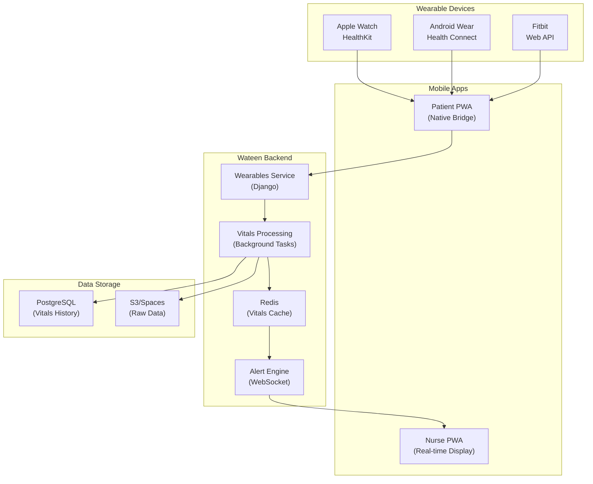

### 8.2.2 Tech Stack

| Component               | Technology               | Implementation Details                                                                      |
| ----------------------- | ------------------------ | ------------------------------------------------------------------------------------------- |
| **iOS Integration**     | HealthKit Framework      | Native iOS bridge using Capacitor plugin for real-time heart rate, SpO2, and blood pressure |
| **Android Integration** | Health Connect API       | Android 14+ native integration with backward compatibility to Google Fit                    |
| **Cross-platform**      | WebSockets               | Real-time streaming of critical vitals to nurse dashboard                                   |
| **Data Processing**     | Django Channels + Celery | Background processing of vitals with anomaly detection                                      |
| **Storage**             | PostgreSQL + TimescaleDB | Time-series optimized storage for vitals history                                            |
| **Alerting**            | Redis Pub/Sub            | Sub-millisecond critical alert delivery                                                     |

### 8.2.3 Data Privacy & Security

- **Encryption**: AES-256 for all vitals data at rest
- **Transmission**: TLS 1.3 with certificate pinning for mobile apps
- **Consent Management**: Explicit per-visit consent with granular data sharing controls
- **Data Retention**: Automatic purging of raw vitals after 30 days, aggregated data retained for 1 year
- **HIPAA Compliance**: Business Associate Agreement with cloud providers

### 8.2.4 API Endpoints

```
POST /api/v1/wearables/authorize/          # Authorize wearable device
GET  /api/v1/wearables/supported/          # List supported devices
POST /api/v1/wearables/vitals/stream/      # Stream vitals data
GET  /api/v1/wearables/vitals/current/     # Get current vitals
GET  /api/v1/wearables/vitals/history/     # Get historical vitals
POST /api/v1/wearables/consent/            # Manage consent preferences
```

### 8.2.5 Data Schema

```sql
CREATE TABLE wearable_devices (
    id UUID PRIMARY KEY,
    patient_id UUID REFERENCES patient_profile(id),
    device_type VARCHAR(50) NOT NULL, -- 'apple_watch', 'android_wear', 'fitbit'
    device_identifier VARCHAR(255) NOT NULL,
    is_active BOOLEAN DEFAULT true,
    authorized_at TIMESTAMP,
    last_sync TIMESTAMP
);

CREATE TABLE vitals_readings (
    id BIGSERIAL PRIMARY KEY,
    patient_id UUID REFERENCES patient_profile(id),
    device_id UUID REFERENCES wearable_devices(id),
    reading_type VARCHAR(50) NOT NULL, -- 'heart_rate', 'spo2', 'blood_pressure'
    value DECIMAL(10,2) NOT NULL,
    unit VARCHAR(20) NOT NULL,
    recorded_at TIMESTAMP NOT NULL,
    received_at TIMESTAMP DEFAULT NOW(),
    is_anomaly BOOLEAN DEFAULT false
);

-- Index for time-series queries
CREATE INDEX idx_vitals_patient_time ON vitals_readings (patient_id, recorded_at DESC);
```

### 8.2.6 Phase Placement

**Phase 8** (Weeks 17-18): Basic iOS HealthKit integration
**Phase 10** (Weeks 21-22): Android Health Connect integration
**Phase 12** (Weeks 25-26): Real-time alerts and anomaly detection

---

## 8.3 Feature 2: "Blackbox" Mission Logging

### 8.3.1 Architecture Diagram

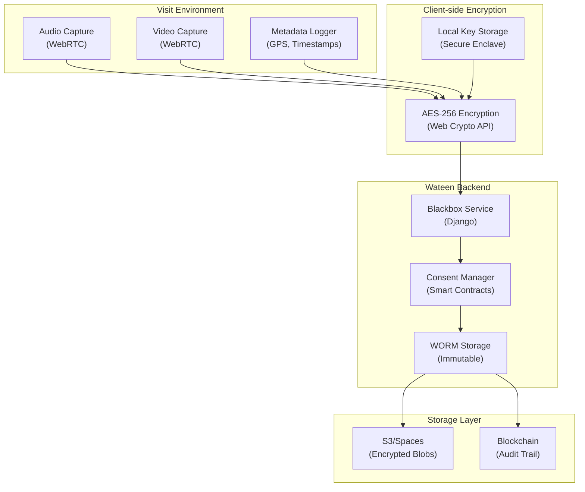

### 8.3.2 Tech Stack

| Component          | Technology                          | Implementation Details                                    |
| ------------------ | ----------------------------------- | --------------------------------------------------------- |
| **Media Capture**  | WebRTC MediaStream API              | Browser-based audio/video recording with adaptive bitrate |
| **Encryption**     | Web Crypto API (AES-256-GCM)        | Client-side encryption before transmission                |
| **Key Management** | Secure Enclave/Keystore             | Device-local key generation and storage                   |
| **Consent**        | Smart Contracts (Ethereum)          | Immutable consent records on blockchain                   |
| **Storage**        | S3 with WORM (Write-Once-Read-Many) | Immutable storage compliance                              |
| **Audit Trail**    | Hyperledger Fabric                  | Private blockchain for access logging                     |

### 8.3.3 Data Privacy & Security

- **Zero-Knowledge Architecture**: Encryption keys never leave the device
- **Consent Blockchain**: Immutable consent records with timestamp
- **WORM Compliance**: Write-Once-Read-Many storage prevents tampering
- **Access Logging**: All access attempts logged to private blockchain
- **Auto-Deletion**: Configurable retention periods (default: 2 years)

### 8.3.4 API Endpoints

```
POST /api/v1/blackbox/consent/request/     # Request recording consent
POST /api/v1/blackbox/session/start/        # Start recording session
POST /api/v1/blackbox/session/stop/         # Stop recording session
POST /api/v1/blackbox/upload/               # Upload encrypted blob
GET  /api/v1/blackbox/sessions/             # List recording sessions
GET  /api/v1/blackbox/access/request/       # Request access to recording
POST /api/v1/blackbox/audit/verify/         # Verify recording integrity
```

### 8.3.5 Data Schema

```sql
CREATE TABLE blackbox_sessions (
    id UUID PRIMARY KEY,
    visit_id UUID REFERENCES visits(id),
    patient_consent_hash VARCHAR(64), -- Blockchain transaction hash
    nurse_consent_hash VARCHAR(64),   -- Blockchain transaction hash
    started_at TIMESTAMP NOT NULL,
    ended_at TIMESTAMP,
    status VARCHAR(20) DEFAULT 'active', -- 'active', 'completed', 'expired'
    encryption_key_id VARCHAR(255), -- Reference to key management system
    retention_days INTEGER DEFAULT 730 -- 2 years default
);

CREATE TABLE blackbox_blobs (
    id UUID PRIMARY KEY,
    session_id UUID REFERENCES blackbox_sessions(id),
    blob_type VARCHAR(20) NOT NULL, -- 'audio', 'video', 'metadata'
    s3_key VARCHAR(255) NOT NULL,
    checksum VARCHAR(64) NOT NULL, -- SHA-256 hash
    size_bytes BIGINT NOT NULL,
    uploaded_at TIMESTAMP DEFAULT NOW()
);

CREATE TABLE blackbox_access_log (
    id BIGSERIAL PRIMARY KEY,
    session_id UUID REFERENCES blackbox_sessions(id),
    requester_id UUID REFERENCES users(id),
    access_type VARCHAR(50) NOT NULL, -- 'view', 'download', 'verify'
    granted_at TIMESTAMP,
    blockchain_tx_hash VARCHAR(64),
    ip_address INET,
    user_agent TEXT
);
```

### 8.3.6 Phase Placement

**Phase 9** (Weeks 19-20): Basic audio recording and encryption
**Phase 11** (Weeks 23-24): Video recording and consent management
**Phase 14** (Weeks 29-30): Blockchain audit trail implementation

---

## 8.4 Feature 3: AI Copilot for Nurses

### 8.4.1 Architecture Diagram

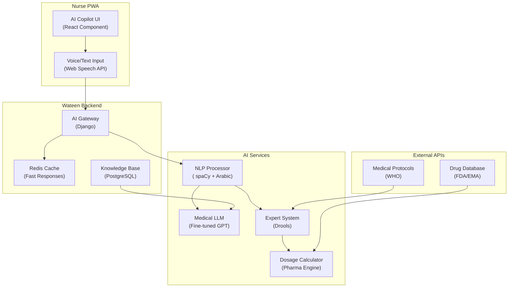

### 8.4.2 Tech Stack

| Component          | Technology                     | Implementation Details                                   |
| ------------------ | ------------------------------ | -------------------------------------------------------- |
| **NLP Processing** | spaCy with Arabic models       | Medical entity recognition and intent classification     |
| **LLM**            | Fine-tuned GPT-4/LLaMA-Medical | Domain-specific medical assistant with safety guardrails |
| **Expert System**  | Drools Rule Engine             | Dosage calculations and drug interaction checks          |
| **Voice Input**    | Web Speech API                 | Arabic speech-to-text with medical vocabulary            |
| **Knowledge Base** | PostgreSQL + Full-text Search  | Medical protocols and drug information                   |
| **Caching**        | Redis                          | Sub-second response times for common queries             |

### 8.4.3 Data Privacy & Security

- **Local Processing**: Sensitive patient data processed on-device when possible
- **Anonymization**: All AI queries anonymized before external API calls
- **Audit Logging**: All AI interactions logged for compliance
- **Model Security**: Regular adversarial testing and prompt injection protection
- **Data Minimization**: Only necessary medical context shared with AI models

### 8.4.4 API Endpoints

```
POST /api/v1/ai/copilot/query/             # Submit query to AI copilot
POST /api/v1/ai/copilot/dosage/calculate/  # Calculate drug dosage
POST /api/v1/ai/copilot/interactions/check/ # Check drug interactions
GET  /api/v1/ai/copilot/protocols/         # Get medical protocols
POST /api/v1/ai/copilot/feedback/           # Submit feedback on AI responses
GET  /api/v1/ai/copilot/history/           # Get AI interaction history
```

### 8.4.5 Data Schema

```sql
CREATE TABLE ai_copilot_interactions (
    id UUID PRIMARY KEY,
    nurse_id UUID REFERENCES nurse_profile(id),
    visit_id UUID REFERENCES visits(id),
    query_type VARCHAR(50) NOT NULL, -- 'dosage', 'interaction', 'protocol', 'general'
    query_text TEXT NOT NULL,
    response_text TEXT NOT NULL,
    confidence_score DECIMAL(3,2), -- 0.00 to 1.00
    sources JSONB, -- References to medical sources
    was_helpful BOOLEAN,
    feedback_text TEXT,
    created_at TIMESTAMP DEFAULT NOW()
);

CREATE TABLE medical_knowledge (
    id UUID PRIMARY KEY,
    category VARCHAR(50) NOT NULL, -- 'drug', 'protocol', 'condition'
    title VARCHAR(255) NOT NULL,
    content TEXT NOT NULL,
    source VARCHAR(100) NOT NULL, -- 'WHO', 'FDA', 'EMA', 'Ministry of Health'
    last_updated TIMESTAMP,
    version INTEGER DEFAULT 1,
    is_active BOOLEAN DEFAULT true
);

CREATE TABLE drug_interactions (
    id UUID PRIMARY KEY,
    drug_a VARCHAR(100) NOT NULL,
    drug_b VARCHAR(100) NOT NULL,
    severity VARCHAR(20) NOT NULL, -- 'mild', 'moderate', 'severe', 'contraindicated'
    description TEXT,
    recommendation TEXT,
    source VARCHAR(100),
    last_reviewed TIMESTAMP
);
```

### 8.4.6 Phase Placement

**Phase 7** (Weeks 15-16): Basic dosage calculator and drug database
**Phase 9** (Weeks 19-20): Drug interaction checker
**Phase 13** (Weeks 27-28): Full AI copilot with LLM integration

---

## 8.5 Feature 4: Unified Health Wallet (Blockchain EMR)

### 8.5.1 Architecture Diagram

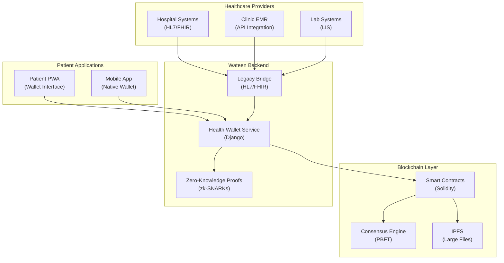

### 8.5.2 Tech Stack

| Component              | Technology                       | Implementation Details                             |
| ---------------------- | -------------------------------- | -------------------------------------------------- |
| **Blockchain**         | Hyperledger Fabric               | Permissioned blockchain for healthcare data        |
| **Smart Contracts**    | Solidity + Web3.js               | Patient-controlled data sharing contracts          |
| **Large File Storage** | IPFS                             | Decentralized storage for medical images/documents |
| **Privacy**            | zk-SNARKs                        | Zero-knowledge proofs for selective disclosure     |
| **Legacy Integration** | HL7/FHIR Bridge                  | Integration with existing hospital systems         |
| **Digital Identity**   | Decentralized Identifiers (DIDs) | Patient-controlled digital identity                |

### 8.5.3 Data Privacy & Security

- **Patient Sovereignty**: Patients control all data sharing through smart contracts
- **Zero-Knowledge Proofs**: Verify credentials without revealing underlying data
- **Granular Consent**: Time-limited, purpose-specific data sharing
- **Immutable Audit Trail**: All access logged to blockchain
- **Encryption**: End-to-end encryption with patient-held keys

### 8.5.4 API Endpoints

```
POST /api/v1/wallet/create/                 # Create health wallet
GET  /api/v1/wallet/records/                # List health records
POST /api/v1/wallet/records/add/            # Add new health record
POST /api/v1/wallet/share/                  # Share records with provider
POST /api/v1/wallet/revoke/                 # Revoke access to records
GET  /api/v1/wallet/consents/               # List active consents
POST /api/v1/wallet/verify/                 # Verify credentials with ZKP
```

### 8.5.5 Data Schema

```sql
CREATE TABLE health_wallets (
    id UUID PRIMARY KEY,
    patient_id UUID REFERENCES patient_profile(id),
    blockchain_address VARCHAR(42) NOT NULL, -- Ethereum address
    did VARCHAR(255) NOT NULL, -- Decentralized Identifier
    public_key TEXT NOT NULL,
    created_at TIMESTAMP DEFAULT NOW(),
    is_active BOOLEAN DEFAULT true
);

CREATE TABLE health_records (
    id UUID PRIMARY KEY,
    wallet_id UUID REFERENCES health_wallets(id),
    record_type VARCHAR(50) NOT NULL, -- 'diagnosis', 'prescription', 'lab_result', 'imaging'
    title VARCHAR(255) NOT NULL,
    content_hash VARCHAR(64) NOT NULL, -- IPFS hash
    provider_id UUID, -- Reference to healthcare provider
    recorded_at TIMESTAMP NOT NULL,
    blockchain_tx_hash VARCHAR(64),
    is_encrypted BOOLEAN DEFAULT true
);

CREATE TABLE data_sharing_consents (
    id UUID PRIMARY KEY,
    wallet_id UUID REFERENCES health_wallets(id),
    requester_did VARCHAR(255) NOT NULL,
    record_types JSONB NOT NULL, -- Array of record types
    purpose TEXT NOT NULL,
    expires_at TIMESTAMP NOT NULL,
    granted_at TIMESTAMP DEFAULT NOW(),
    blockchain_tx_hash VARCHAR(64),
    is_active BOOLEAN DEFAULT true
);

CREATE TABLE healthcare_providers (
    id UUID PRIMARY KEY,
    name VARCHAR(255) NOT NULL,
    did VARCHAR(255) NOT NULL,
    blockchain_address VARCHAR(42),
    provider_type VARCHAR(50) NOT NULL, -- 'hospital', 'clinic', 'lab', 'pharmacy'
    verification_status VARCHAR(20) DEFAULT 'pending',
    license_documents JSONB, -- References to verified licenses
);
```

### 8.5.6 Phase Placement

**Phase 10** (Weeks 21-22): Basic wallet creation and record storage
**Phase 12** (Weeks 25-26): Smart contract implementation and consent management
**Phase 15** (Weeks 31-32): ZKP implementation and provider integration

---

## 8.6 Feature 5: "The Shield" (Audio Safety Protocol)

### 8.6.1 Architecture Diagram

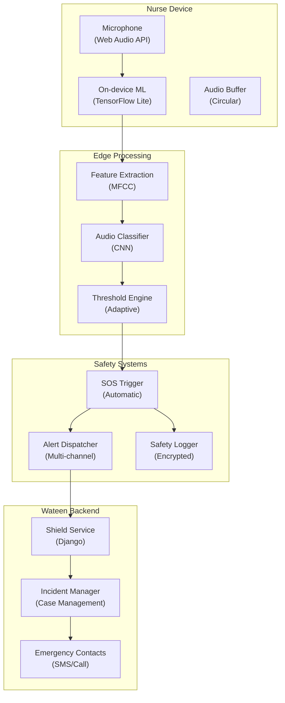

### 8.6.2 Tech Stack

| Component                | Technology                                 | Implementation Details                            |
| ------------------------ | ------------------------------------------ | ------------------------------------------------- |
| **Audio Capture**        | Web Audio API                              | Real-time audio capture with noise cancellation   |
| **On-device ML**         | TensorFlow Lite                            | Privacy-preserving audio classification on device |
| **Audio Features**       | MFCC (Mel-frequency cepstral coefficients) | Standard audio feature extraction                 |
| **Classification Model** | Custom CNN                                 | Trained on aggression/distress audio patterns     |
| **Adaptive Thresholds**  | Statistical anomaly detection              | Reduces false positives based on environment      |
| **Emergency Dispatch**   | Multi-channel alerting                     | SMS, in-app, and emergency service integration    |

### 8.6.3 Data Privacy & Security

- **On-device Processing**: No audio data transmitted to cloud unless triggered
- **Encrypted Logging**: Incident logs encrypted with AES-256
- **Configurable Sensitivity**: User-adjustable sensitivity levels
- **Auto-purge**: Audio buffers automatically purged after 5 minutes
- **Consent-based**: Explicit opt-in with clear privacy notice

### 8.6.4 API Endpoints

```
POST /api/v1/shield/configure/             # Configure shield settings
POST /api/v1/shield/sos/trigger/           # Manual SOS trigger
POST /api/v1/shield/sos/cancel/            # Cancel false alarm
GET  /api/v1/shield/incidents/             # List safety incidents
POST /api/v1/shield/incident/resolve/      # Mark incident as resolved
GET  /api/v1/shield/status/                # Get shield status
POST /api/v1/shield/test/                  # Test shield functionality
```

### 8.6.5 Data Schema

```sql
CREATE TABLE shield_configurations (
    id UUID PRIMARY KEY,
    nurse_id UUID REFERENCES nurse_profile(id),
    is_enabled BOOLEAN DEFAULT true,
    sensitivity_level INTEGER DEFAULT 3, -- 1-5 scale
    auto_trigger_types JSONB, -- ['aggression', 'distress', 'panic']
    emergency_contacts JSONB, -- Array of contact information
    voice_keywords JSONB, -- Custom trigger words
    updated_at TIMESTAMP DEFAULT NOW()
);

CREATE TABLE safety_incidents (
    id UUID PRIMARY KEY,
    nurse_id UUID REFERENCES nurse_profile(id),
    visit_id UUID REFERENCES visits(id),
    incident_type VARCHAR(50) NOT NULL, -- 'auto_aggression', 'auto_distress', 'manual'
    trigger_confidence DECIMAL(3,2), -- 0.00 to 1.00
    audio_snippet_hash VARCHAR(64), -- Reference to encrypted audio
    location POINT, -- GPS location at time of incident
    triggered_at TIMESTAMP NOT NULL,
    resolved_at TIMESTAMP,
    resolution_notes TEXT,
    false_alarm BOOLEAN DEFAULT false
);

CREATE TABLE emergency_responses (
    id UUID PRIMARY KEY,
    incident_id UUID REFERENCES safety_incidents(id),
    response_type VARCHAR(50) NOT NULL, -- 'sms', 'call', 'police', 'ambulance'
    contact_info VARCHAR(255) NOT NULL,
    dispatched_at TIMESTAMP DEFAULT NOW(),
    acknowledged_at TIMESTAMP,
    response_status VARCHAR(20) DEFAULT 'pending' -- 'pending', 'acknowledged', 'completed'
);
```

### 8.6.6 Phase Placement

**Phase 8** (Weeks 17-18): Basic audio capture and on-device ML
**Phase 11** (Weeks 23-24): SOS triggering and emergency dispatch
**Phase 13** (Weeks 27-28): Advanced classification and adaptive thresholds

---

## 8.7 Feature 6: Hyper-Local Navigation Layer

### 8.7.1 Architecture Diagram

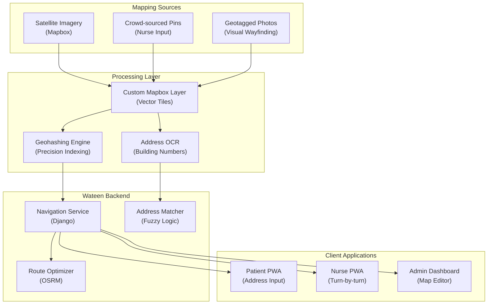

### 8.7.2 Tech Stack

| Component              | Technology                         | Implementation Details                             |
| ---------------------- | ---------------------------------- | -------------------------------------------------- |
| **Base Maps**          | Mapbox GL JS + Custom Vector Tiles | High-quality maps with custom data layers          |
| **Geohashing**         | Geohash library                    | Precision location indexing for unstructured areas |
| **Photo Wayfinding**   | Computer Vision + TensorFlow       | Building entrance identification from photos       |
| **Address OCR**        | Tesseract + Custom Models          | Extract building numbers from street view          |
| **Route Optimization** | OSRM (Open Source Routing Machine) | Fast routing with custom weights                   |
| **Offline Maps**       | Mapbox Offline                     | Cached map tiles for areas with poor connectivity  |

### 8.7.3 Data Privacy & Security

- **Location Blurring**: Sensitive locations (homes, clinics) slightly blurred in public maps
- **Opt-in Data**: Only nurses can contribute mapping data with explicit consent
- **Access Control**: Different map detail levels for different user types
- **Data Validation**: All crowd-sourced data validated before inclusion
- **Retention Policy**: Original photos deleted after feature extraction

### 8.7.4 API Endpoints

```
GET  /api/v1/navigation/map/tiles/         # Get custom map tiles
POST /api/v1/navigation/pin/add/           # Add location pin
POST /api/v1/navigation/photo/upload/      # Upload wayfinding photo
GET  /api/v1/navigation/address/search/    # Search addresses
GET  /api/v1/navigation/route/             # Get optimized route
POST /api/v1/navigation/correction/        # Submit map correction
GET  /api/v1/navigation/areas/             # Get mapped areas
```

### 8.7.5 Data Schema

```sql
CREATE TABLE location_pins (
    id UUID PRIMARY KEY,
    latitude DECIMAL(10,8) NOT NULL,
    longitude DECIMAL(11,8) NOT NULL,
    pin_type VARCHAR(50) NOT NULL, -- 'entrance', 'landmark', 'clinic', 'pharmacy'
    title VARCHAR(255),
    description TEXT,
    floor_number VARCHAR(10),
    building_color VARCHAR(20), -- Visual identifier
    added_by UUID REFERENCES nurse_profile(id),
    verified_at TIMESTAMP,
    is_active BOOLEAN DEFAULT true,
    created_at TIMESTAMP DEFAULT NOW()
);

CREATE TABLE wayfinding_photos (
    id UUID PRIMARY KEY,
    location_id UUID REFERENCES location_pins(id),
    photo_url VARCHAR(255) NOT NULL,
    heading DECIMAL(5,2), -- Direction photo was taken
    features JSONB, -- Extracted features (doors, signs, etc.)
    uploaded_by UUID REFERENCES nurse_profile(id),
    is_verified BOOLEAN DEFAULT false,
    created_at TIMESTAMP DEFAULT NOW()
);

CREATE TABLE address_mappings (
    id UUID PRIMARY KEY,
    text_address VARCHAR(255) NOT NULL,
    normalized_address VARCHAR(255),
    location POINT,
    confidence_score DECIMAL(3,2),
    pin_id UUID REFERENCES location_pins(id),
    usage_count INTEGER DEFAULT 0,
    last_used TIMESTAMP,
    created_at TIMESTAMP DEFAULT NOW()
);

CREATE TABLE navigation_areas (
    id UUID PRIMARY KEY,
    area_name VARCHAR(255) NOT NULL,
    boundary POLYGON NOT NULL,
    area_type VARCHAR(50) NOT NULL, -- 'ashwaiyat', 'formal', 'industrial'
    mapping_quality INTEGER DEFAULT 0, -- 0-100 scale
    last_updated TIMESTAMP DEFAULT NOW()
);
```

### 8.7.6 Phase Placement

**Phase 6** (Weeks 13-14): Basic custom map layer and pinning system
**Phase 9** (Weeks 19-20): Photo wayfinding and address OCR
**Phase 11** (Weeks 23-24): Advanced routing and offline maps

---

## 8.8 Feature 7: Health Rewards (Gamification)

### 8.8.1 Architecture Diagram

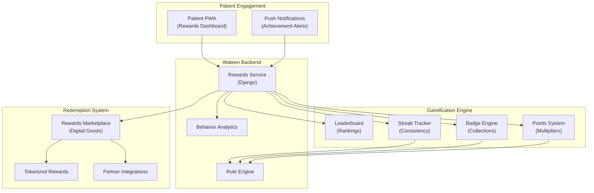

### 8.8.2 Tech Stack

| Component               | Technology                | Implementation Details                          |
| ----------------------- | ------------------------- | ----------------------------------------------- |
| **Gamification Engine** | Custom Django App + Redis | Real-time points calculation and badge awarding |
| **Rule Engine**         | Drools                    | Complex reward rules and conditions             |
| **Behavior Analytics**  | Python + Pandas           | Patient engagement pattern analysis             |
| **Token System**        | ERC-20 Tokens             | Blockchain-based reward tokens                  |
| **Marketplace**         | React + Stripe            | Digital goods and service redemptions           |
| **Notifications**       | Firebase Cloud Messaging  | Achievement and streak notifications            |

### 8.8.3 Data Privacy & Security

- **Opt-in Participation**: Explicit opt-in for gamification features
- **Anonymous Leaderboards**: Default to anonymous rankings with opt-in for public display
- **Data Minimization**: Only collect necessary engagement data
- **Secure Tokens**: Blockchain-based rewards with secure wallet integration
- **Privacy Controls**: Granular controls over data sharing for leaderboards

### 8.8.4 API Endpoints

```
GET  /api/v1/rewards/profile/              # Get rewards profile
GET  /api/v1/rewards/points/               # Get points balance
GET  /api/v1/rewards/badges/               # Get earned badges
GET  /api/v1/rewards/streaks/              # Get active streaks
GET  /api/v1/rewards/leaderboard/          # Get leaderboard
POST /api/v1/rewards/redeem/               # Redeem rewards
GET  /api/v1/rewards/marketplace/          # Get marketplace items
POST /api/v1/rewards/preferences/          # Update preferences
```

### 8.8.5 Data Schema

```sql
CREATE TABLE reward_profiles (
    id UUID PRIMARY KEY,
    patient_id UUID REFERENCES patient_profile(id),
    total_points INTEGER DEFAULT 0,
    current_level INTEGER DEFAULT 1,
    is_opted_in BOOLEAN DEFAULT true,
    is_public_leaderboard BOOLEAN DEFAULT false,
    created_at TIMESTAMP DEFAULT NOW(),
    updated_at TIMESTAMP DEFAULT NOW()
);

CREATE TABLE reward_points (
    id BIGSERIAL PRIMARY KEY,
    patient_id UUID REFERENCES patient_profile(id),
    points INTEGER NOT NULL,
    reason VARCHAR(100) NOT NULL, -- 'visit_completed', 'streak_milestone', 'referral'
    multiplier DECIMAL(3,2) DEFAULT 1.0,
    awarded_at TIMESTAMP DEFAULT NOW(),
    expires_at TIMESTAMP
);

CREATE TABLE reward_badges (
    id UUID PRIMARY KEY,
    badge_code VARCHAR(50) NOT NULL,
    title VARCHAR(255) NOT NULL,
    description TEXT,
    icon_url VARCHAR(255),
    rarity VARCHAR(20) DEFAULT 'common', -- 'common', 'rare', 'epic', 'legendary'
    points_value INTEGER DEFAULT 0
);

CREATE TABLE patient_badges (
    id UUID PRIMARY KEY,
    patient_id UUID REFERENCES patient_profile(id),
    badge_id UUID REFERENCES reward_badges(id),
    earned_at TIMESTAMP DEFAULT NOW(),
    progress_data JSONB -- For progress tracking
);

CREATE TABLE reward_streaks (
    id UUID PRIMARY KEY,
    patient_id UUID REFERENCES patient_profile(id),
    streak_type VARCHAR(50) NOT NULL, -- 'weekly_visits', 'medication_adherence'
    current_count INTEGER DEFAULT 0,
    best_count INTEGER DEFAULT 0,
    last_activity DATE,
    is_active BOOLEAN DEFAULT true
);

CREATE TABLE marketplace_items (
    id UUID PRIMARY KEY,
    item_name VARCHAR(255) NOT NULL,
    description TEXT,
    points_cost INTEGER NOT NULL,
    item_type VARCHAR(50) NOT NULL, -- 'discount', 'service', 'digital_good'
    partner_id UUID,
    is_active BOOLEAN DEFAULT true,
    stock_quantity INTEGER,
    created_at TIMESTAMP DEFAULT NOW()
);

CREATE TABLE reward_redemptions (
    id UUID PRIMARY KEY,
    patient_id UUID REFERENCES patient_profile(id),
    item_id UUID REFERENCES marketplace_items(id),
    points_used INTEGER NOT NULL,
    redemption_code VARCHAR(255),
    status VARCHAR(20) DEFAULT 'pending', -- 'pending', 'completed', 'expired'
    redeemed_at TIMESTAMP DEFAULT NOW(),
    expires_at TIMESTAMP
);
```

### 8.8.6 Phase Placement

**Phase 7** (Weeks 15-16): Basic points system and badges
**Phase 10** (Weeks 21-22): Streaks and leaderboards
**Phase 14** (Weeks 29-30): Marketplace and tokenized rewards

---

## 8.9 Feature 8: Hybrid Telemedicine (3-Way Consult)

### 8.9.1 Architecture Diagram

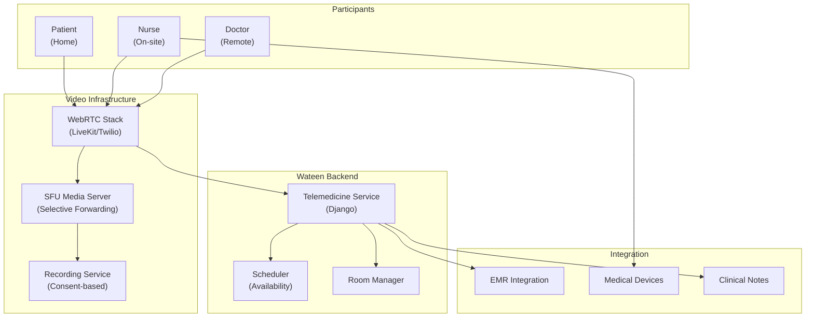

### 8.9.2 Tech Stack

| Component              | Technology                              | Implementation Details                      |
| ---------------------- | --------------------------------------- | ------------------------------------------- |
| **Video Platform**     | LiveKit or Twilio Video API             | 3-way video with screen sharing             |
| **WebRTC**             | Native WebRTC with fallbacks            | Low-latency P2P and SFU routing             |
| **Recording**          | Consent-based recording with encryption | Session recording for medical records       |
| **Device Integration** | Web Bluetooth API                       | Integration with medical devices            |
| **Scheduling**         | CalDAV integration                      | Doctor availability and appointment booking |
| **Clinical Notes**     | FHIR-compliant note system              | Standardized medical documentation          |

### 8.9.3 Data Privacy & Security

- **End-to-end Encryption**: All video streams encrypted with DTLS-SRTP
- **Consent Recording**: Explicit consent for recording and documentation
- **HIPAA Compliance**: Full compliance with healthcare video standards
- **Access Controls**: Role-based access to consultations and recordings
- **Secure Storage**: Encrypted storage of consultation recordings

### 8.9.4 API Endpoints

```
POST /api/v1/telemedicine/consult/request/  # Request 3-way consult
GET  /api/v1/telemedicine/availability/     # Get doctor availability
POST /api/v1/telemedicine/room/create/      # Create consultation room
GET  /api/v1/telemedicine/room/join/        # Get room access token
POST /api/v1/telemedicine/room/end/         # End consultation
GET  /api/v1/telemedicine/consultations/    # List consultation history
POST /api/v1/telemedicine/notes/            # Add clinical notes
GET  /api/v1/telemedicine/recordings/       # Get consultation recordings
```

### 8.9.5 Data Schema

```sql
CREATE TABLE telemedicine_consultations (
    id UUID PRIMARY KEY,
    visit_id UUID REFERENCES visits(id),
    patient_id UUID REFERENCES patient_profile(id),
    nurse_id UUID REFERENCES nurse_profile(id),
    doctor_id UUID REFERENCES doctor_profile(id),
    room_name VARCHAR(255) NOT NULL,
    status VARCHAR(20) DEFAULT 'scheduled', -- 'scheduled', 'active', 'completed', 'cancelled'
    scheduled_at TIMESTAMP NOT NULL,
    started_at TIMESTAMP,
    ended_at TIMESTAMP,
    recording_consent BOOLEAN DEFAULT false,
    recording_url VARCHAR(255),
    created_at TIMESTAMP DEFAULT NOW()
);

CREATE TABLE doctor_profiles (
    id UUID PRIMARY KEY,
    user_id UUID REFERENCES users(id),
    full_name_ar VARCHAR(255),
    full_name_en VARCHAR(255),
    specialization VARCHAR(100),
    license_number VARCHAR(100),
    is_available BOOLEAN DEFAULT false,
    hourly_rate DECIMAL(10,2),
    consultation_fee DECIMAL(10,2),
    rating DECIMAL(3,2) DEFAULT 5.0,
    created_at TIMESTAMP DEFAULT NOW()
);

CREATE TABLE doctor_availability (
    id UUID PRIMARY KEY,
    doctor_id UUID REFERENCES doctor_profile(id),
    day_of_week INTEGER NOT NULL, -- 0-6 (Sunday-Saturday)
    start_time TIME NOT NULL,
    end_time TIME NOT NULL,
    is_recurring BOOLEAN DEFAULT true,
    specific_date DATE, -- For one-time availability
    is_booked BOOLEAN DEFAULT false,
    created_at TIMESTAMP DEFAULT NOW()
);

CREATE TABLE clinical_notes (
    id UUID PRIMARY KEY,
    consultation_id UUID REFERENCES telemedicine_consultations(id),
    author_id UUID REFERENCES users(id),
    note_type VARCHAR(20) NOT NULL, -- 'subjective', 'objective', 'assessment', 'plan'
    content TEXT NOT NULL,
    is_private BOOLEAN DEFAULT false, -- Visible to patient?
    created_at TIMESTAMP DEFAULT NOW(),
    updated_at TIMESTAMP DEFAULT NOW()
);

CREATE TABLE medical_device_readings (
    id UUID PRIMARY KEY,
    consultation_id UUID REFERENCES telemedicine_consultations(id),
    device_type VARCHAR(50) NOT NULL, -- 'blood_pressure', 'glucose', 'temperature'
    reading_value DECIMAL(10,2) NOT NULL,
    unit VARCHAR(20) NOT NULL,
    recorded_at TIMESTAMP NOT NULL,
    recorded_by UUID REFERENCES nurse_profile(id)
);
```

### 8.9.6 Phase Placement

**Phase 9** (Weeks 19-20): Basic 2-way video consultation
**Phase 11** (Weeks 23-24): 3-way consultation with doctor integration
**Phase 13** (Weeks 27-28): Medical device integration and recording

---

## 8.10 Feature 9: Epidemic Prediction Dashboard

### 8.10.1 Architecture Diagram

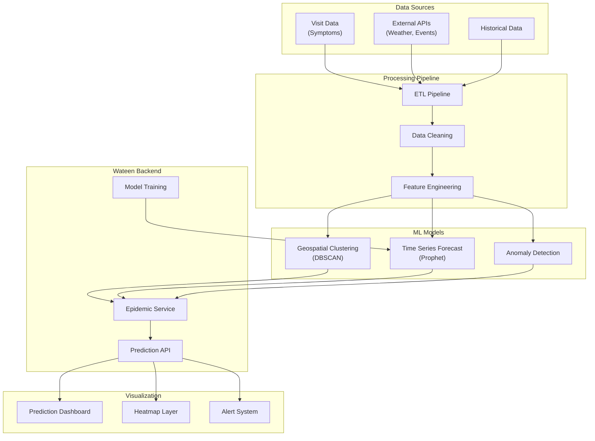

### 8.10.2 Tech Stack

| Component               | Technology                 | Implementation Details                      |
| ----------------------- | -------------------------- | ------------------------------------------- |
| **Data Pipeline**       | Apache Airflow             | Scheduled ETL for symptom and external data |
| **Geospatial Analysis** | PostGIS + DBSCAN           | Clustering of symptom locations             |
| **Time Series**         | Facebook Prophet           | Seasonal epidemic forecasting               |
| **Anomaly Detection**   | Isolation Forest           | Early outbreak detection                    |
| **Visualization**       | React + D3.js + Mapbox     | Interactive dashboard with heatmaps         |
| **Alerting**            | Custom notification system | Multi-channel epidemic alerts               |

### 8.10.3 Data Privacy & Security

- **Aggregation Only**: No individual patient data in predictions
- **Spatial Blurring**: Locations aggregated to neighborhood level
- **Differential Privacy**: Statistical noise added to prevent re-identification
- **Access Controls**: Restricted access to prediction data
- **Data Retention**: Raw symptom data purged after aggregation

### 8.10.4 API Endpoints

```
GET  /api/v1/epidemic/dashboard/            # Get dashboard data
GET  /api/v1/epidemic/heatmap/              # Get current symptom heatmap
GET  /api/v1/epidemic/predictions/          # Get epidemic predictions
GET  /api/v1/epidemic/clusters/             # Get current symptom clusters
GET  /api/v1/epidemic/trends/               # Get historical trends
POST /api/v1/epidemic/alerts/subscribe/     # Subscribe to alerts
GET  /api/v1/epidemic/models/status/        # Get model training status
```

### 8.10.5 Data Schema

```sql
CREATE TABLE symptom_reports (
    id BIGSERIAL PRIMARY KEY,
    visit_id UUID REFERENCES visits(id),
    patient_location POINT NOT NULL,
    symptoms JSONB NOT NULL, -- Array of reported symptoms
    severity INTEGER NOT NULL, -- 1-10 scale
    reported_at TIMESTAMP NOT NULL,
    geohash VARCHAR(12) NOT NULL, -- For spatial indexing
    processed_at TIMESTAMP DEFAULT NOW()
);

CREATE TABLE epidemic_clusters (
    id UUID PRIMARY KEY,
    cluster_center POINT NOT NULL,
    cluster_radius DECIMAL(8,2), -- In meters
    symptom_type VARCHAR(100) NOT NULL,
    case_count INTEGER NOT NULL,
    severity_score DECIMAL(3,2),
    first_detected TIMESTAMP NOT NULL,
    last_updated TIMESTAMP DEFAULT NOW(),
    is_active BOOLEAN DEFAULT true
);

CREATE TABLE epidemic_predictions (
    id UUID PRIMARY KEY,
    prediction_date DATE NOT NULL,
    region_id UUID REFERENCES zones(id),
    disease_type VARCHAR(100) NOT NULL,
    predicted_cases INTEGER NOT NULL,
    confidence_interval JSONB, -- [lower, upper] bounds
    model_version VARCHAR(20) NOT NULL,
    created_at TIMESTAMP DEFAULT NOW()
);

CREATE TABLE epidemic_alerts (
    id UUID PRIMARY KEY,
    alert_type VARCHAR(50) NOT NULL, -- 'outbreak_risk', 'trend_increase', 'cluster_detected'
    severity VARCHAR(20) NOT NULL, -- 'low', 'medium', 'high', 'critical'
    affected_regions JSONB, -- Array of region IDs
    message TEXT NOT NULL,
    recommended_actions JSONB,
    issued_at TIMESTAMP DEFAULT NOW(),
    expires_at TIMESTAMP,
    is_active BOOLEAN DEFAULT true
);

CREATE TABLE model_training_runs (
    id UUID PRIMARY KEY,
    model_name VARCHAR(100) NOT NULL,
    model_version VARCHAR(20) NOT NULL,
    training_data_start DATE,
    training_data_end DATE,
    accuracy_metrics JSONB,
    training_duration_seconds INTEGER,
    status VARCHAR(20) DEFAULT 'running', -- 'running', 'completed', 'failed'
    started_at TIMESTAMP DEFAULT NOW(),
    completed_at TIMESTAMP
);
```

### 8.10.6 Phase Placement

**Phase 12** (Weeks 25-26): Basic symptom tracking and clustering
**Phase 15** (Weeks 31-32): Time series forecasting and predictions
**Phase 18** (Weeks 37-38): Full dashboard with alerting system

---

## 8.11 Integration with Existing Architecture

### 8.11.1 Modular Integration Strategy

The 9 advanced features integrate with the existing modular monolith architecture through dedicated service modules:

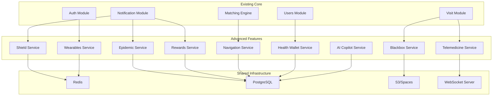

### 8.11.2 Database Schema Extensions

The advanced features extend the existing database schema with new tables while maintaining compatibility:

```sql
-- Extensions to existing tables
ALTER TABLE visits ADD COLUMN wearables_enabled BOOLEAN DEFAULT false;
ALTER TABLE visits ADD COLUMN blackbox_consent BOOLEAN DEFAULT false;
ALTER TABLE visits ADD COLUMN telemedicine_consult_id UUID REFERENCES telemedicine_consultations(id);
ALTER TABLE patient_profile ADD COLUMN wallet_id UUID REFERENCES health_wallets(id);
ALTER TABLE nurse_profile ADD COLUMN shield_enabled BOOLEAN DEFAULT false;
ALTER TABLE nurse_profile ADD COLUMN reward_points INTEGER DEFAULT 0;

-- New feature-specific tables (defined in each feature section)
-- [All tables from sections 8.2.5 through 8.10.5]
```

### 8.11.3 API Gateway Extensions

The API gateway is extended with new route groups for each feature:

```
# New API route groups
/api/v1/wearables/*          # Wearables Integration
/api/v1/blackbox/*           # Blackbox Mission Logging
/api/v1/ai/copilot/*         # AI Copilot for Nurses
/api/v1/wallet/*             # Unified Health Wallet
/api/v1/shield/*             # Audio Safety Protocol
/api/v1/navigation/*         # Hyper-Local Navigation
/api/v1/rewards/*            # Health Rewards
/api/v1/telemedicine/*       # Hybrid Telemedicine
/api/v1/epidemic/*           # Epidemic Prediction
```

---

## 8.12 20-Phase Implementation Roadmap

### 8.12.1 Phase Overview

| Phase         | Duration    | Primary Focus            | Key Features                                |
| ------------- | ----------- | ------------------------ | ------------------------------------------- |
| **Phase 1-4** | Weeks 1-16  | Core Platform            | Existing implementation plan features       |
| **Phase 5**   | Weeks 17-18 | IoT Foundation           | Wearables Integration (Basic)               |
| **Phase 6**   | Weeks 19-20 | Location Services        | Hyper-Local Navigation (Basic)              |
| **Phase 7**   | Weeks 21-22 | AI & Gamification        | AI Copilot (Basic), Health Rewards (Basic)  |
| **Phase 8**   | Weeks 23-24 | Safety & Security        | Blackbox (Basic), Shield (Basic)            |
| **Phase 9**   | Weeks 25-26 | Blockchain               | Health Wallet (Basic), Epidemic (Basic)     |
| **Phase 10**  | Weeks 27-28 | Telemedicine             | Hybrid Telemedicine (Basic)                 |
| **Phase 11**  | Weeks 29-30 | Advanced AI              | AI Copilot (Full), Shield (Advanced)        |
| **Phase 12**  | Weeks 31-32 | Advanced Blockchain      | Health Wallet (Full), Rewards (Marketplace) |
| **Phase 13**  | Weeks 33-34 | Advanced Telemedicine    | Telemedicine (Full with Devices)            |
| **Phase 14**  | Weeks 35-36 | Advanced Navigation      | Navigation (Offline + Advanced)             |
| **Phase 15**  | Weeks 37-38 | Predictive Analytics     | Epidemic Prediction (Full)                  |
| **Phase 16**  | Weeks 39-40 | Integration & Testing    | Cross-feature integration                   |
| **Phase 17**  | Weeks 41-42 | Security Hardening       | Advanced security features                  |
| **Phase 18**  | Weeks 43-44 | Performance Optimization | Scaling and optimization                    |
| **Phase 19**  | Weeks 45-46 | Compliance & Audit       | Full compliance verification                |
| **Phase 20**  | Weeks 47-48 | Launch Preparation       | Production readiness                        |

### 8.12.2 Resource Allocation

Resource Strategy: Hyper-Pair Programming

The project is executed by a single unit:
1 Human Lead: Product ownership, logic validation, and deployment.
1 AI Architect (Wateen Gem I): Heavy lifting, code generation, testing, and documentation.

Zero Hiring: No external engineers required.

### 8.12.3 Technology Acquisition Timeline

| Technology                    | Phase Required | Lead Time | Notes                                     |
| ----------------------------- | -------------- | --------- | ----------------------------------------- |
| **HealthKit/Health Connect**  | Phase 5        | 2 weeks   | Developer accounts and certificates       |
| **TensorFlow Lite Models**    | Phase 8        | 4 weeks   | Model training and optimization           |
| **Blockchain Infrastructure** | Phase 9        | 6 weeks   | Node setup and smart contract development |
| **WebRTC Infrastructure**     | Phase 10       | 3 weeks   | LiveKit/Twilio account setup              |
| **Medical LLM**               | Phase 11       | 8 weeks   | Fine-tuning and safety testing            |
| **IPFS Integration**          | Phase 12       | 2 weeks   | Node setup and configuration              |
| **Medical Device APIs**       | Phase 13       | 4 weeks   | SDK integration and testing               |
| **Epidemic Data Sources**     | Phase 15       | 3 weeks   | API agreements and data pipelines         |

---

## 8.13 Success Metrics and KPIs

### 8.13.1 Feature Adoption Metrics

| Feature                      | Primary KPI                    | Target (Month 6) | Target (Month 12) |
| ---------------------------- | ------------------------------ | ---------------- | ----------------- |
| **Wearables Integration**    | % of visits with vitals data   | 25%              | 60%               |
| **Blackbox Mission Logging** | % of visits with recording     | 15%              | 40%               |
| **AI Copilot**               | % of nurses using daily        | 30%              | 80%               |
| **Health Wallet**            | % of patients with wallet      | 20%              | 50%               |
| **Shield Protocol**          | % of nurses enabled            | 40%              | 90%               |
| **Navigation Layer**         | % of unstructured areas mapped | 10%              | 35%               |
| **Health Rewards**           | % of active patients engaged   | 35%              | 70%               |
| **Telemedicine**             | % of visits with 3-way consult | 5%               | 25%               |
| **Epidemic Prediction**      | Prediction accuracy (F1 score) | 0.75             | 0.85              |

### 8.13.2 Technical Performance Metrics

| Metric                          | Target          | Measurement Method         |
| ------------------------------- | --------------- | -------------------------- |
| **API Response Time**           | < 200ms (p95)   | APM monitoring             |
| **WebSocket Latency**           | < 50ms          | Real-time monitoring       |
| **ML Inference Time**           | < 100ms         | Model performance tracking |
| **Blockchain Transaction Time** | < 5s            | Node monitoring            |
| **Video Call Quality**          | > 4.0 MOS       | WebRTC stats               |
| **Map Tile Load Time**          | < 300ms         | Performance monitoring     |
| **Mobile App Crashes**          | < 0.5% sessions | Crash reporting            |

### 8.13.3 Business Impact Metrics

| Metric                    | Target (Year 1)   | Measurement Method   |
| ------------------------- | ----------------- | -------------------- |
| **Patient Retention**     | > 85%             | Cohort analysis      |
| **Nurse Utilization**     | > 75% active time | Scheduling analytics |
| **Visit Completion Rate** | > 95%             | Operations tracking  |
| **Patient Satisfaction**  | > 4.5/5.0         | Post-visit surveys   |
| **Nurse Satisfaction**    | > 4.0/5.0         | Regular surveys      |
| **Revenue per Visit**     | +30% vs baseline  | Financial reporting  |
| **Market Share**          | 15% Cairo market  | Market analysis      |

---

## 8.14 Risk Mitigation Strategies

### 8.14.1 Technical Risks

| Risk                         | Probability | Impact | Mitigation Strategy                                                  |
| ---------------------------- | ----------- | ------ | -------------------------------------------------------------------- |
| **ML Model Accuracy**        | Medium      | High   | Continuous training, human oversight, fallback to rule-based systems |
| **Blockchain Scalability**   | Low         | Medium | Layer-2 solutions, sharding, hybrid architecture                     |
| **Real-time Performance**    | Medium      | High   | Load testing, CDN, edge computing                                    |
| **Device Compatibility**     | High        | Medium | Progressive enhancement, fallback options                            |
| **Third-party Dependencies** | Medium      | Medium | Multiple vendors, in-house alternatives                              |

### 8.14.2 Regulatory Risks

| Risk                           | Probability | Impact   | Mitigation Strategy                                    |
| ------------------------------ | ----------- | -------- | ------------------------------------------------------ |
| **Healthcare Data Privacy**    | Medium      | Critical | Privacy by design, regular audits, legal review        |
| **Medical Device Regulations** | Medium      | High     | Compliance team, certification process                 |
| **Cross-border Data Transfer** | Low         | Medium   | Local data storage, data minimization                  |
| **AI in Healthcare**           | Medium      | High     | Explainable AI, human oversight, regulatory engagement |

### 8.14.3 Implementation Risks

| Risk                       | Probability | Impact | Mitigation Strategy                                                                            |
| -------------------------- | ----------- | ------ | ---------------------------------------------------------------------------------------------- |
| **Feature Complexity**     | High        | Medium | Phased rollout, MVP approach                                                                   |
| **Knowledge Gaps**         | Medium      | High   | Strict documentation, AI-maintained knowledge base, external consultants for specialized areas |
| **Integration Challenges** | Medium      | High   | API contracts, integration testing                                                             |
| **User Adoption**          | Medium      | High   | User research, onboarding, incentives                                                          |

---

## 8.15 Conclusion

The 9 Next-Gen Health-Tech Features represent a significant evolution of the Wateen platform from a simple on-demand service to a comprehensive healthcare ecosystem. By following the phased implementation approach outlined above, the team can deliver these complex features while maintaining the stability and performance of the core platform.

Key success factors include:

1. **Modular Architecture**: The existing modular monolith approach provides a solid foundation for adding complex features
2. **Phased Rollout**: The 20-phase roadmap allows for iterative development and testing
3. **Privacy by Design**: Each feature incorporates strong privacy and security measures from the start
4. **User-Centric Approach**: Features are designed to solve real problems for patients and nurses
5. **Technical Excellence**: High standards for code quality, performance, and reliability

With proper execution of this plan, Wateen will establish itself as a leader in healthcare technology innovation in Egypt and the broader region.

---

# 9. The Solo-Dev Operational Playbook

## 9.1 Infrastructure Cost Projection

### Phase 1: Free Tier Strategy (The "Lean" Start)
*Perfect for development and initial beta testing (0-100 users).*

| Component | Provider | Tier | Cost |
| :--- | :--- | :--- | :--- |
| **Frontend Options** | Vercel / Netlify | Hobby Tier | **$0/mo** |
| **Backend & DB** | Supabase / Railway | Free Tier | **$0/mo** |
| **Repo & CI/CD** | GitHub | Free Tier (2000 min blocks) | **$0/mo** |
| **Authentication** | Supabase Auth / Clerk | Free Tier (< 50,000 MAU) | **$0/mo** |
| **Total** | | | **$0 / month** |

### Phase 2: Scale Strategy (Production)
*Recommended for active launch (100+ active daily users).*

| Component | Provider | Configuration | Est. Cost |
| :--- | :--- | :--- | :--- |
| **VPS (Docker)** | DigitalOcean | Basic Droplet (1GB RAM) | **$6/mo** |
| **Managed DB** | DigitalOcean | Managed Postgres (Essential) | **$15/mo** |
| **Domain** | Namecheap | .app or .com | **~$1/mo** |
| **Storage** | DigitalOcean Spaces | 250GB | **$5/mo** |
| **Total** | | | **~$27 / month** |

## 9.2 AI Context Maintenance Strategy

To keep **Wateen Gem I** (the AI Architect) effective:

1.  **Weekly Context Refresh:**
    *   Run `tree /f /a > codebase_structure.txt` (exclude `.git`, `node_modules`, `venv`).
    *   Upload this file to the AI chat to refresh its understanding of the file structure.
2.  **Daily Implementation Update:**
    *   At the end of each session, update `task.md` and `implementation_plan_v3.2.md` (mark completed tickets).
    *   Brief the AI: "We completed Phase X. Status is now Y."
3.  **Documentation First:**
    *   Before coding a complex feature, ask the AI to "Update the Architecture Section for Feature X" in a separate doc.

## 9.3 The Daily Routine (4-Hour Block)

Suggested schedule to maintain velocity without burnout:

*   **Hour 1: Architecture & Review (The "Lead" Hat)**
    *   Review yesterday's code.
    *   Plan the day's *single* ticket.
    *   Update documentation.
*   **Hours 2-3: Hyper-Pairing (The "Coding" Hat)**
    *   Active coding with AI.
    *   Generate boilerplate, refine logic, debug.
*   **Hour 4: Testing & Verify (The "QA" Hat)**
    *   Run tests.
    *   Manual verification (click through the PWA).
    *   Commit & Push.

## 9.4 Disaster Recovery Protocol
*Goal: Restore regular development environment in < 30 minutes.*

1.  **Git Clone:** `git clone <repo_url>`
2.  **Environment Restore:**
    *   Find `env.example` file.
    *   Retrieve secrets from Password Manager (Bitwarden/1Password).
    *   Create `.env` file.
3.  **Docker Up:** `docker-compose up -d --build`
4.  **Database Restore:**
    *   Running automated backups? `pg_restore -d wateen < latest_backup.dump`.
    *   Development seed? `python manage.py loaddata initial_data.json`.
5.  **Verify:** Run `pytest`. If green, you are back online.

---

# 10. AI-Native IDE Configuration

To enforce architectural consistency, add the following `.cursorrules` file to the root of your project. This instructs the AI Editor (Cursor/Windsurf) on how to behave.

## 10.1 System Prompt (.cursorrules)

```markdown
# Wateen Project Rules

## Context
You are an expert AI software engineer building "Wateen", a Django Modular Monolith + Next.js PWA healthcare platform for Egypt.

## Tech Stack
- **Backend:** Python 3.11, Django 5.0, Django Ninja (or DRF), PostgreSQL, Redis.
- **Frontend:** Next.js 14 (App Router), React, Tailwind CSS, TypeScript.
- **Styling:** Tailwind CSS (RTL enforcement: `dir="rtl"`).
- **Icons:** Lucide React.

## Coding Style
- **Python:** Black formatter compliance. Type hints (mypy) are mandatory.
- **JavaScript:** Prettier compliance. Functional components only.
- **Communication:** Be concise. Don't explain basic concepts unless asked.

## Architectural Enforcement
1.  **Modular Monolith:** Functionality is grouped by Django Apps (e.g., `visits`, `users`, `billing`). Do not create circular dependencies between apps.
2.  **Business Logic:** Keep views thin. Put complex logic in `services.py` or `selectors.py` within the app.
3.  **Tickets:** Always implement code based on the specific requirements of the active Engineering Ticket. Do not implement features not requested.

## Critical Rules
- **Never Hallucinate Packages:** Only use packages listed in `requirements.txt` or `package.json`. If a new package is needed, ask for permission first.
- **Security First:** Never hardcode secrets. Use `os.environ` or `config()` from `decouple`.
- **RTL Support:** Always ensure UI components support Right-to-Left layouts (margin-start/margin-end instead of left/right).
```

---

# 11. Conclusion

This Master Implementation Plan v3.2 reflects the ultimate "AI-Native" approach. It not only defines *what* to build but explicitly configures *how* the AI and Human Operator will collaborate.

By merging strict engineering tickets with an AI-enforced IDE configuration, Wateen is positioned for rapid, high-quality execution by a solo operator.

**Status:** Ready for Execution.
**Next Step:** Initialize Repository & Apply `.cursorrules`.
