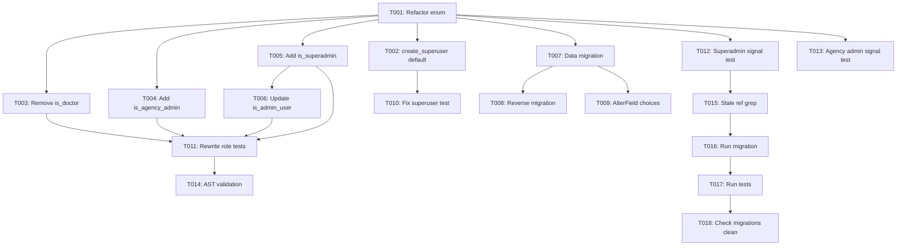

# Tasks: User Role Enum Refactoring (006-user-role-enum)

**Feature**: 006-user-role-enum
**Generated**: 2026-03-01
**Source**: [spec.md](file:///d:/projects/Wateen/specs/006-user-role-enum/spec.md) · [plan.md](file:///d:/projects/Wateen/specs/006-user-role-enum/plan.md) · [data-model.md](file:///d:/projects/Wateen/specs/006-user-role-enum/data-model.md)

---

## User Stories → Task Mapping

| Story | Spec Scenario | Priority | Description                     |
| ----- | ------------- | -------- | ------------------------------- |
| US1   | Scenario 1    | P1       | Role Assignment at Registration |
| US2   | Scenario 2    | P1       | Role-Based Property Checks      |
| US3   | Scenario 3    | P1       | SuperAdmin Privileges           |
| US4   | Scenario 4    | P1       | Data Migration of Legacy Roles  |

---

## Phase 1: Setup

> No project initialization needed — modifying existing codebase.

---

## Phase 2: Foundational — Enum Refactoring

> **Goal**: Establish the canonical 4-role enum that all other tasks depend on.
> **Test Criteria**: `UserRole` contains exactly PATIENT, NURSE, AGENCY_ADMIN, SUPERADMIN.

- [x] T001 [US1] Refactor `UserRole` TextChoices enum: remove DOCTOR and ADMIN, add SUPERADMIN in `users/models.py`
- [x] T002 [US1] Update `create_superuser()` default role from `UserRole.ADMIN` to `UserRole.SUPERADMIN` in `users/models.py`

---

## Phase 3: User Story 2 — Property Accessors

> **Goal**: All 4 role-checking `@property` methods exist and return correct booleans.
> **Test Criteria**: Each property returns `True` for its role and `False` for all others.
> **Depends on**: Phase 2 (enum must be defined first)

- [x] T003 [P] [US2] Remove `is_doctor` property from `CustomUser` in `users/models.py`
- [x] T004 [P] [US2] Add `is_agency_admin` property to `CustomUser` in `users/models.py`
- [x] T005 [P] [US2] Add `is_superadmin` property to `CustomUser` in `users/models.py`

---

## Phase 4: User Story 3 — SuperAdmin Backward Compatibility

> **Goal**: `is_admin_user` returns `True` for SUPERADMIN (backward-compat with old ADMIN logic).
> **Test Criteria**: `is_admin_user` returns `True` when `role == SUPERADMIN` or `is_superuser == True`.
> **Depends on**: Phase 3 (is_superadmin must exist)

- [x] T006 [US3] Update `is_admin_user` property logic from `UserRole.ADMIN` to `UserRole.SUPERADMIN` in `users/models.py`

---

## Phase 5: User Story 4 — Data Migration

> **Goal**: All legacy ADMIN/DOCTOR rows are remapped; no orphaned values remain.
> **Test Criteria**: Zero database rows with role values `ADMIN` or `DOCTOR` after migration.
> **Depends on**: Phase 2 (new enum values must be valid before migrating data)

- [x] T007 [US4] Create data migration `users/migrations/0004_refactor_userrole_enum.py` with RunPython to map ADMIN→SUPERADMIN and DOCTOR→NURSE
- [x] T008 [US4] Add reverse migration function (SUPERADMIN→ADMIN) for rollback safety in `users/migrations/0004_refactor_userrole_enum.py`
- [x] T009 [US4] Add AlterField operation to update `role` field choices to 4-value enum in `users/migrations/0004_refactor_userrole_enum.py`

---

## Phase 6: Test Updates

> **Goal**: All existing tests pass with new enum; new role coverage is comprehensive.
> **Test Criteria**: `python manage.py test users -v 2` passes with 0 failures.
> **Depends on**: All previous phases

- [x] T010 Update `test_create_superuser_success` assertion from `'ADMIN'` to `'SUPERADMIN'` in `users/tests.py`
- [x] T011 [P] Rewrite `test_user_role_properties` to test all 4 roles with `is_patient`, `is_nurse`, `is_agency_admin`, `is_superadmin` in `users/tests.py`
- [x] T012 [P] Rename `test_no_profile_for_doctor_role` → `test_no_profile_for_superadmin_role` using `UserRole.SUPERADMIN` in `users/tests.py`
- [x] T013 [P] Rename `test_no_profile_for_admin_role` → `test_no_profile_for_agency_admin_role` using `UserRole.AGENCY_ADMIN` in `users/tests.py`

---

## Phase 7: Verification & Polish

> **Goal**: Ensure zero stale references and runtime correctness.

- [x] T014 Run AST parse validation on all 3 changed files (models.py, tests.py, migration)
- [x] T015 Grep entire `users/` directory for stale references to `UserRole.DOCTOR`, `UserRole.ADMIN`, and `is_doctor`
- [ ] T016 Run `python manage.py migrate users` to apply migration (requires GDAL + PostGIS)
- [ ] T017 Run `python manage.py test users -v 2` to validate all tests pass (requires GDAL + PostGIS)
- [ ] T018 Run `python manage.py makemigrations --check --dry-run` to confirm no pending migrations

---

## Dependencies

## Parallel Execution Opportunities

| Group | Tasks            | Rationale                                                  |
| ----- | ---------------- | ---------------------------------------------------------- |
| A     | T003, T004, T005 | Independent property changes in same file, different lines |
| B     | T008, T009       | Both within same migration file but independent operations |
| C     | T011, T012, T013 | Independent test methods in same file                      |

## Implementation Strategy

- **MVP**: T001-T006 (enum + properties) — the core model change
- **Full delivery**: T001-T018 (enum + migration + tests + verification)
- **Current status**: T001-T015 complete ✅, T016-T018 blocked on environment (GDAL/PostGIS)

---

## Summary

| Metric          | Value                                        |
| --------------- | -------------------------------------------- |
| Total tasks     | 18                                           |
| Completed       | 15                                           |
| Blocked (env)   | 3                                            |
| User stories    | 4                                            |
| Parallel groups | 3                                            |
| Files modified  | 3 (`models.py`, `tests.py`, new `0004_*.py`) |
