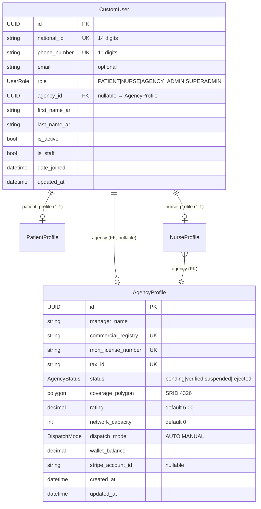

# Data Model: RBAC Security Hardening

**Branch**: `007-rbac-security-hardening` | **Date**: 2026-03-01

---

## Entity Relationship Diagram



---

## Entities Involved in This Feature

### CustomUser (existing — no schema changes)

| Field    | Type               | Constraints                                           | Relevance                                                    |
| -------- | ------------------ | ----------------------------------------------------- | ------------------------------------------------------------ |
| `role`   | CharField(15)      | TextChoices: PATIENT, NURSE, AGENCY_ADMIN, SUPERADMIN | Core field for permission checks and registration validation |
| `agency` | FK → AgencyProfile | nullable, SET_NULL                                    | Used by `IsAgencyAdmin` to check verified status             |

**Validation rules**:

- Self-registration: `role` limited to `PATIENT` or `AGENCY_ADMIN`
- Profile update: `role` is read-only (already enforced)
- Default: `PATIENT`

### AgencyProfile (existing — no schema changes)

| Field    | Type          | Constraints                                         | Relevance                           |
| -------- | ------------- | --------------------------------------------------- | ----------------------------------- |
| `status` | CharField(20) | TextChoices: pending, verified, suspended, rejected | Gate for `IsAgencyAdmin` permission |

**State transitions relevant to permission**:

- `pending` → access denied
- `verified` → access granted
- `suspended` → access denied
- `rejected` → access denied

### UserRole (existing enum — no changes)

```python
class UserRole(models.TextChoices):
    PATIENT = "PATIENT"
    NURSE = "NURSE"
    AGENCY_ADMIN = "AGENCY_ADMIN"
    SUPERADMIN = "SUPERADMIN"
```

**Registration rules**:

- Public self-registration: PATIENT, AGENCY_ADMIN only
- SUPERADMIN: CLI only (`create_superuser`)
- NURSE: Agency invitation flow only

---

## No Schema Changes Required

This feature is purely behavioral (permission logic, serializer validation, migration data). No new fields, tables, or indexes are needed.
