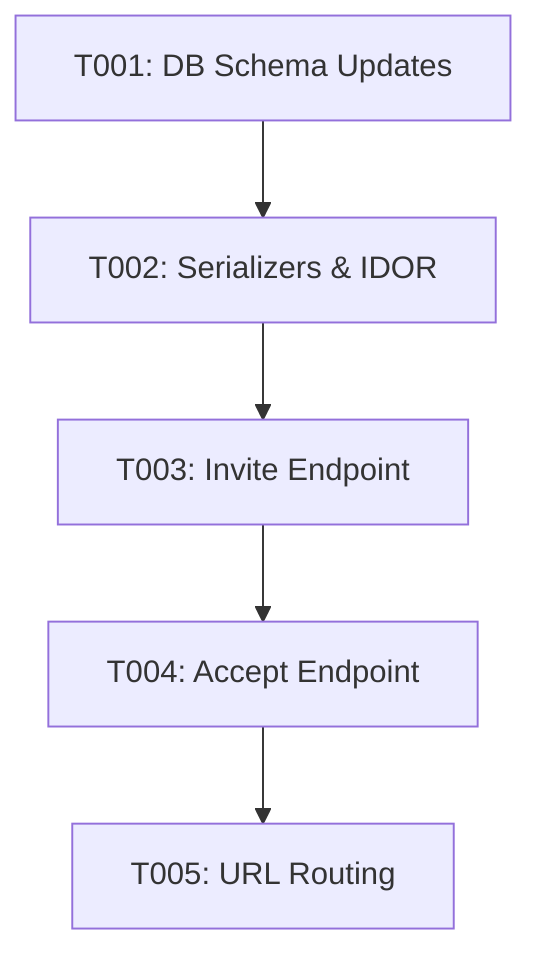

# Tasks: Nurse Invitation Flow

**Feature**: Nurse Invitation Flow
**Branch**: `009-nurse-invitation`
**Spec**: `/specs/009-nurse-invitation/spec.md`

## Implementation Strategy

- **MVP**: Enable an `AGENCY_ADMIN` to invite a nurse (Endpoint 1) and allow the nurse to register using the cryptographic token (Endpoint 2).
- **Incremental Delivery**: Start with database schema updates to `NurseProfile` and the new `NurseInvitation` model. Follow up with robust serialization enforcing IDOR protections, and finish with the Views and Endpoint exposure.

## Dependencies

## Phase 1: Setup

- [x] T000 Update `NurseProfile` and create `NurseInvitation` model in `users/models.py` (Completed in Phase 1 Design).

## Phase 2: Foundational

- [x] T001 Generate and run Django migrations for the updated `NurseProfile` and new `NurseInvitation` models using `manage.py makemigrations` and `manage.py migrate`.

## Phase 3: Nurse Invitation (User Story 1 - P1)

**Story Goal**: Agency Admin can issue a secure, cryptographic 72-hour invitation to a nurse.
**Independent Test**: The endpoint creates a `NurseInvitation` and returns the cryptographic UUID.

- [x] T002 [US1] Create the `users/nurse_serializers.py` file with the `NurseInvitationSerializer`.
- [x] T003 [US1] Create the `users/nurse_views.py` file with the `POST /api/v1/agencies/invite-nurse/` endpoint validating `IsAgencyAdmin`.

## Phase 4: Nurse Acceptance (User Story 2 - P1)

**Story Goal**: Prospective nurse accepts the invitation, safely creating their `CustomUser` and `NurseProfile` atomically.
**Independent Test**: The endpoint successfully processes a valid token, creates the user and profile bound to the agency, and raises transactional rollbacks on errors.

- [x] T004 [US2] Update `users/nurse_serializers.py` to include `NurseProfileSerializer` with strict `validate_agency` IDOR protection.
- [x] T005 [US2] Update `users/nurse_views.py` to include the `POST /api/v1/auth/accept-invitation/` endpoint utilizing `@transaction.atomic`.
- [x] T006 [P] [US2] Register both new endpoints in `users/urls.py`.

## Phase 5: Verification & Polish

- [x] T007 Write unit tests in `users/tests/test_nurse_invitation.py` covering IDOR rejections, token expiry, and strict `transation.atomic` behavior.
- [x] T008 Execute `pytest` to ensure all functionality passes perfectly.
